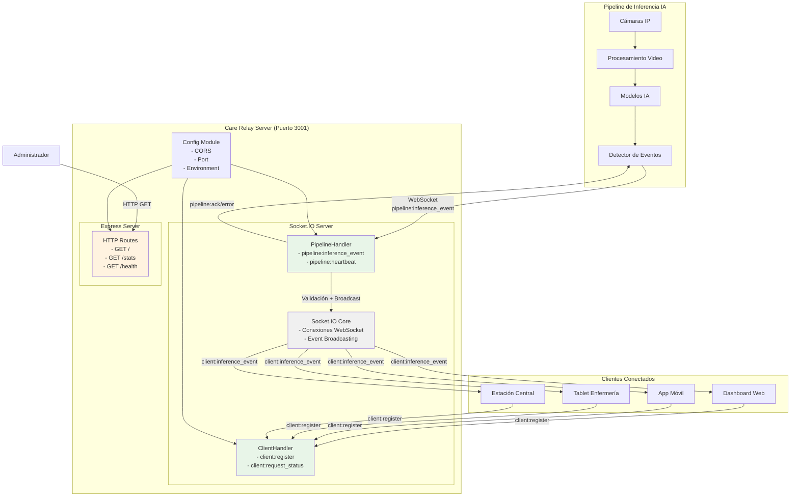
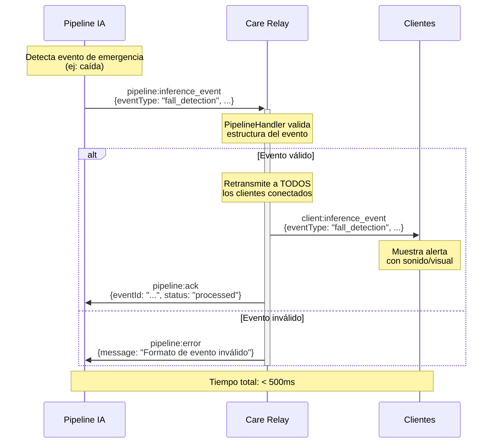
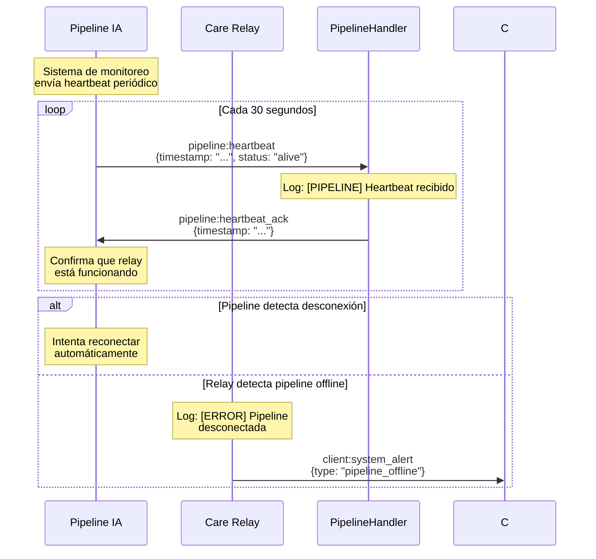
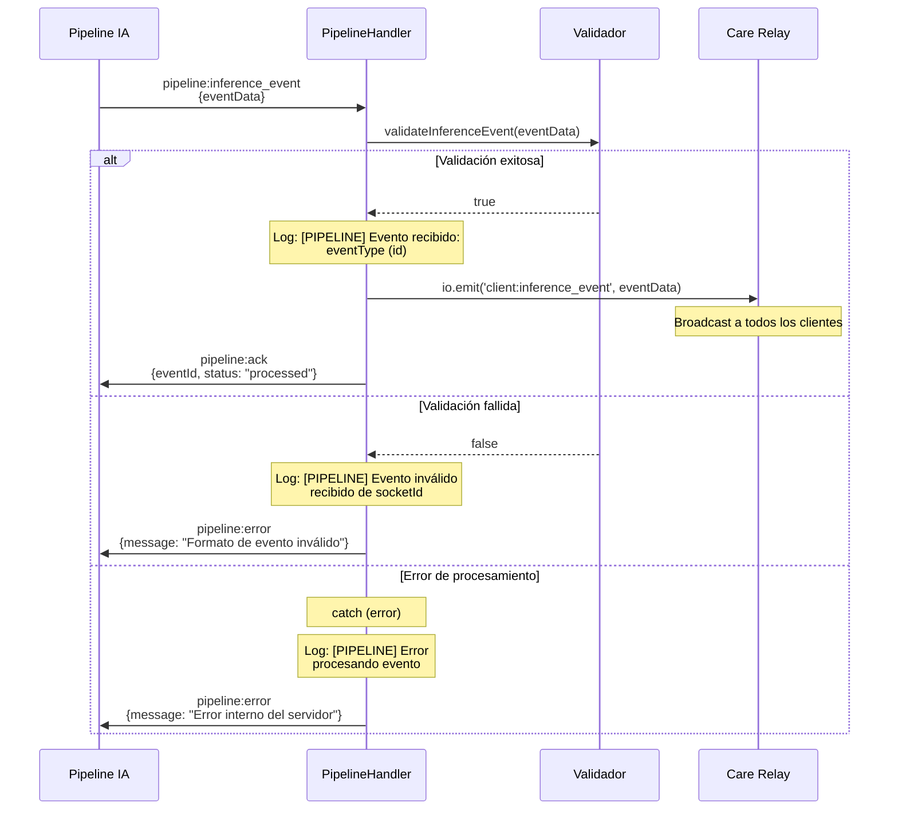

# Care Relay - Arquitectura del Sistema

**Versión:** 1.0.0  
**Fecha:** 10 de Junio 2025  
**Documento:** Arquitectura de Sistema  

---

## 🏗️ Vista General de la Arquitectura

El Care Relay implementa una **arquitectura de microservicio en tiempo real** basada en el patrón **Publisher-Subscriber** con WebSockets. El sistema actúa como un broker de mensajes inteligente entre la pipeline de IA y los clientes conectados.

### Diagrama de Arquitectura



---

## 📦 Componentes del Sistema

### 1. **PipelineHandler**
**Responsabilidad:** Gestión de eventos provenientes de la pipeline de IA

**Funciones:**
- Recepción de eventos via WebSocket
- Validación de estructura de datos
- Manejo de heartbeat/monitoreo
- Confirmación de recepción (ACK)

**Eventos Manejados:**
```typescript
pipeline:inference_event → Validación → Retransmisión
pipeline:heartbeat → pipeline:heartbeat_ack
```

### 2. **ClientHandler**
**Responsabilidad:** Gestión de clientes conectados (interfaces de usuario)

**Funciones:**
- Registro y desregistro de clientes
- Distribución de eventos a todos los clientes
- Envío de estadísticas
- Tracking de conexiones activas

**Eventos Manejados:**
```typescript
client:register → client:registration_success
client:request_status → client:status_response
```

### 3. **CareRelayServer**
**Responsabilidad:** Orquestación y configuración del servidor

**Funciones:**
- Configuración Express + Socket.IO
- Middleware y rutas HTTP
- Inicialización de handlers
- Manejo elegante de señales de cierre

### 4. **ConfigModule**
**Responsabilidad:** Configuración centralizada

**Parámetros:**
- Puerto del servidor
- Configuración CORS
- Niveles de logging
- Variables de entorno

---

## 🔄 Flujo de Datos Detallado

### Secuencia de Eventos de Emergencia



### Gestión de Conexiones de Clientes

```mermaid
sequenceDiagram
    participant C as Cliente (UI)
    participant R as Care Relay
    participant CH as ClientHandler

    Note over C: Usuario abre aplicación<br/>de monitoreo

    C->>+R: WebSocket Connect
    
    Note over R,CH: Socket.IO acepta conexión
    
    R->>CH: Nueva conexión detectada
    Note over CH: Log: [CLIENT] Nueva conexión
    
    C->>CH: client:register<br/>{name: "Dashboard-Enfermeria"}
    
    Note over CH: Añade cliente al Set<br/>de conexiones activas
    
    CH->>C: client:registration_success<br/>{clientId: "...", timestamp: "..."}
    CH->>C: client:current_stats<br/>{connectedClients: N, uptime: ...}
    
    Note over C: Cliente listo para<br/>recibir eventos
    
    loop Eventos en tiempo real
        R->>C: client:inference_event<br/>{eventType: "...", ...}
        Note over C: Procesa y muestra evento
    end
    
    opt Petición de estado
        C->>CH: client:request_status
        CH->>C: client:status_response<br/>{status: "healthy", ...}
    end
    
    C->>-R: disconnect
    Note over CH: Remueve cliente del Set<br/>Log: [CLIENT] Cliente desconectado
```

### Monitoreo y Heartbeat de Pipeline



### Manejo de Errores y Validación



---

## 🛠️ Stack Tecnológico

### Runtime y Lenguaje
- **Node.js 18+** - Runtime JavaScript
- **TypeScript 5.5** - Lenguaje tipado
- **ES Modules** - Sistema de módulos moderno

### Frameworks y Librerías
- **Express 4.19** - Framework HTTP
- **Socket.IO 4.7** - WebSockets en tiempo real
- **tsx** - Ejecutor TypeScript con hot reload

### Herramientas de Desarrollo
- **TypeScript Compiler** - Compilación a JavaScript
- **npm** - Gestor de paquetes
- **Node Types** - Tipado para Node.js APIs

---

## ⚙️ Configuración de Deployment

### Variables de Entorno

```bash
# Servidor
PORT=3001                    # Puerto de escucha
NODE_ENV=production         # Entorno de ejecución

# Seguridad
ALLOWED_ORIGINS=https://care-dashboard.com,https://care-mobile.com
LOG_LEVEL=info              # Nivel de logging

# Opcional
CORS_ENABLED=true           # Habilitar/deshabilitar CORS
MAX_CONNECTIONS=100         # Límite de conexiones simultáneas
```

### Estructura de Directorios en Producción

```
/opt/care-relay/
├── dist/                   # JavaScript compilado
│   ├── @types/
│   ├── config/
│   ├── modules/
│   ├── server.js
│   └── index.js
├── node_modules/           # Dependencias
├── package.json
├── package-lock.json
└── logs/                   # Logs del sistema
    ├── access.log
    ├── error.log
    └── care-relay.log
```

---

## 🔒 Consideraciones de Seguridad

### Comunicación
- **WebSocket Secure (WSS)** en producción
- **TLS 1.3** para cifrado de transporte
- **CORS configurado** por lista blanca de dominios

### Validación de Datos
```typescript
// Ejemplo de validación implementada
private validateInferenceEvent(event: any): event is InferenceEventDto {
  return (
    event &&
    typeof event.id === 'string' &&
    typeof event.timestamp === 'string' &&
    typeof event.eventType === 'string' &&
    event.data &&
    typeof event.data.confidence === 'number' &&
    typeof event.sourceId === 'string'
  );
}
```

### Logging y Auditoría
```
[PIPELINE] Nueva conexión desde pipeline: abc123
[CLIENT] Cliente registrado: def456 {name: "Dashboard-Enfermeria"}
[PIPELINE] Evento recibido: fall_detection (event-789)
[CLIENT] Cliente desconectado: def456
```

---

## 📊 Métricas y Monitoreo

### Métricas Expuestas via HTTP

**GET /stats**
```json
{
  "connectedClients": 12,
  "serverUptime": 86400.5,
  "timestamp": "2025-06-10T16:00:00.000Z",
  "memoryUsage": {
    "rss": 104501248,
    "heapTotal": 14151680,
    "heapUsed": 12261648,
    "external": 3953722,
    "arrayBuffers": 68146
  }
}
```

**GET /health**
```json
{
  "status": "ok"
}
```

### Logs Estructurados
```
[2025-06-10T16:00:00.000Z] [RELAY] Nueva conexión: client-001
[2025-06-10T16:00:01.000Z] [PIPELINE] Evento recibido: fall_detection (evt-123)
[2025-06-10T16:00:01.100Z] [CLIENT] Evento retransmitido a 8 clientes
```

---

## ⚡ Optimizaciones de Rendimiento

### Gestión de Memoria
- **Event Listeners** - Cleanup automático en desconexiones
- **Sin almacenamiento** - Relay puro sin persistencia
- **Garbage Collection** - Optimizado para baja latencia

### Concurrencia
- **Event Loop** - Single-threaded con eventos asíncronos
- **Socket.IO** - Pool de conexiones optimizado
- **TypeScript** - Compilación AOT para mejor rendimiento

### Latencia
- **Validación rápida** - Verificaciones mínimas necesarias
- **Broadcast eficiente** - Socket.IO optimizado para múltiples clientes
- **Sin transformaciones** - Retransmisión directa de eventos

---

## 🔄 Patrones de Diseño Implementados

### 1. **Observer Pattern**
```typescript
// Los clientes se suscriben a eventos
socket.on('client:inference_event', handleEvent);

// El relay notifica a todos los observadores
this.io.emit('client:inference_event', eventData);
```

### 2. **Strategy Pattern**
```typescript
// Diferentes handlers para diferentes tipos de conexión
export class PipelineHandler { /* ... */ }
export class ClientHandler { /* ... */ }
```

### 3. **Factory Pattern**
```typescript
// El servidor crea y configura componentes
constructor() {
  this.pipelineHandler = new PipelineHandler(this.io);
  this.clientHandler = new ClientHandler(this.io);
}
```

### 4. **Singleton Pattern**
```typescript
// Configuración centralizada
export const config = { /* ... */ } as const;
```

---

## 🚀 Escalabilidad y Futuras Mejoras

### Escalabilidad Horizontal
- **Clustering** - Múltiples instancias con load balancer
- **Redis Adapter** - Compartir estado entre instancias
- **Microservicios** - Separar pipeline y client handlers

### Mejoras de Funcionalidad
- **Rate Limiting** - Prevenir spam de eventos
- **Event Persistence** - Almacenamiento opcional en DB
- **Authentication** - JWT tokens para clientes
- **Metrics Dashboard** - UI para monitoreo en tiempo real

### Optimizaciones Técnicas
- **Message Compression** - Gzip para eventos grandes
- **Connection Pooling** - Reutilización de conexiones
- **Caching** - Redis para estadísticas frecuentes
- **Containerización** - Docker para deployment

---

## ✅ Criterios de Calidad Arquitectural

### Escalabilidad ⭐⭐⭐⭐⭐
- Soporte para 100+ clientes concurrentes
- Arquitectura preparada para clustering
- Uso eficiente de recursos

### Mantenibilidad ⭐⭐⭐⭐⭐
- Código TypeScript tipado
- Separación clara de responsabilidades
- Documentación completa

### Disponibilidad ⭐⭐⭐⭐⭐
- Manejo robusto de errores
- Reconexión automática de clientes
- Logs completos para debugging

### Seguridad ⭐⭐⭐⭐⭐
- Validación estricta de datos
- CORS configurable
- Preparado para HTTPS/WSS

El Care Relay representa una **arquitectura sólida y escalable** que cumple con los estándares de sistemas críticos de tiempo real, proporcionando la base tecnológica confiable que el ecosistema Alerta Care necesita. 