# Documento de Arquitectura - care-relay-r1

## 1. Visión General de la Arquitectura

### 1.1 Propósito
Este documento define la arquitectura del sistema **care-relay-r1**, un relay de comunicación en tiempo real basado en WebSockets que facilita la comunicación entre múltiples clientes conectados.

### 1.2 Objetivos Arquitectónicos
- **Alta disponibilidad**: 99.9% uptime
- **Baja latencia**: < 100ms para comunicación local
- **Escalabilidad**: Soporte para 10K+ conexiones concurrentes
- **Extensibilidad**: Arquitectura modular para futuras funcionalidades
- **Mantenibilidad**: Código limpio y bien documentado

## 2. Arquitectura de Alto Nivel

### 2.1 Diagrama de Arquitectura General

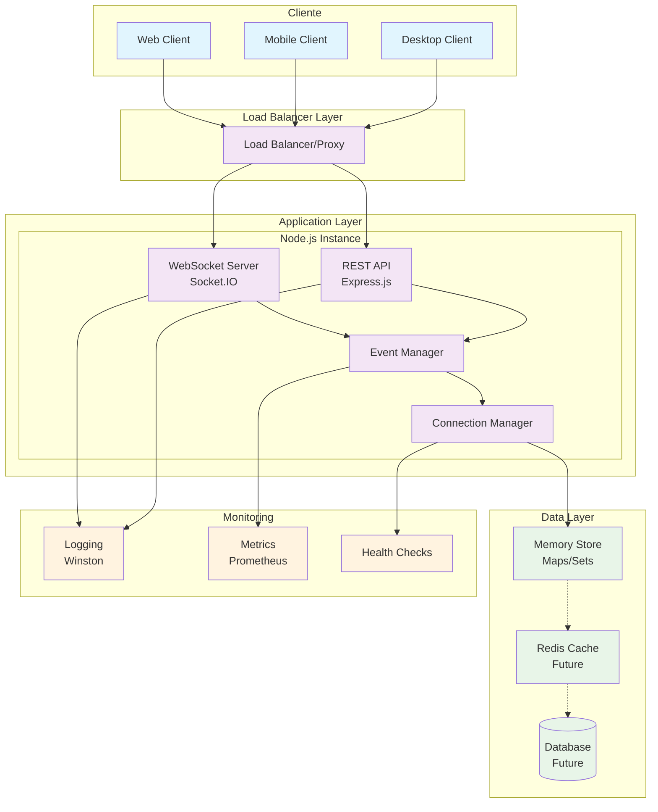

### 2.2 Patrones Arquitectónicos Aplicados

#### 2.2.1 Event-Driven Architecture (EDA)
- **Desacoplamiento**: Componentes se comunican via eventos
- **Escalabilidad**: Fácil adición de nuevos event handlers
- **Resilencia**: Fallos aislados no afectan todo el sistema

#### 2.2.2 Layered Architecture
- **Presentation Layer**: Cliente WebSocket/HTTP
- **Application Layer**: Lógica de negocio y routing
- **Data Layer**: Gestión de estado y persistencia

#### 2.2.3 Pub/Sub Pattern
- **Publishers**: Clientes que envían mensajes
- **Subscribers**: Clientes que reciben mensajes
- **Broker**: Servidor relay que distribuye mensajes

## 3. Componentes Arquitectónicos Detallados

### 3.1 WebSocket Server (Socket.IO)

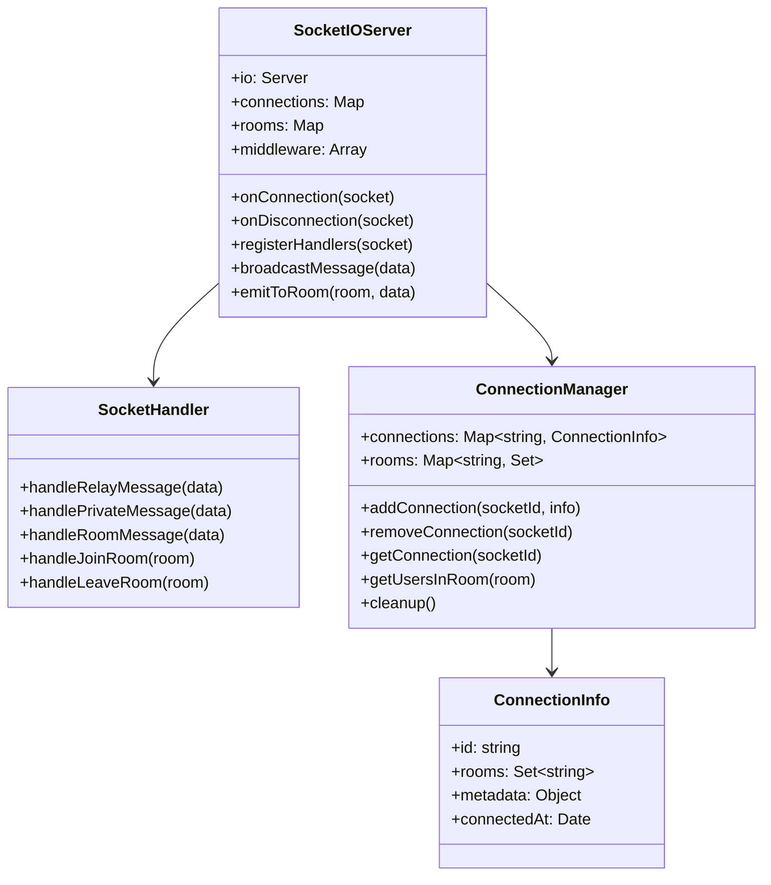

### 3.2 REST API Layer

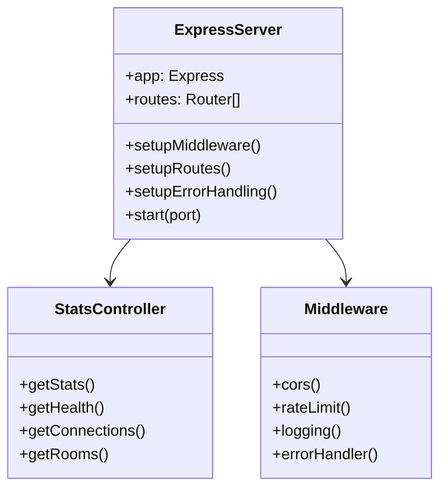

### 3.3 Event Management System

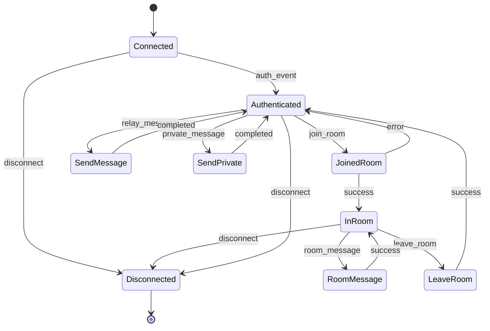

## 4. Flujo de Datos y Comunicación

### 4.1 Flujo de Mensajes Generales

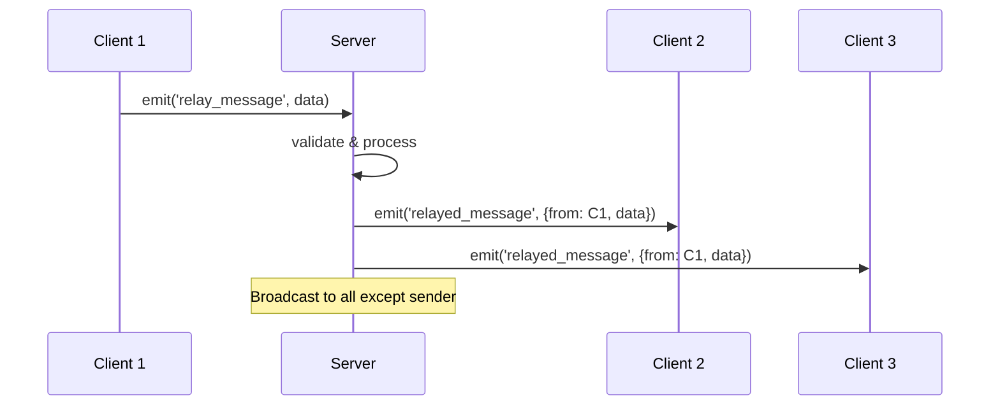

### 4.2 Flujo de Mensajes Privados

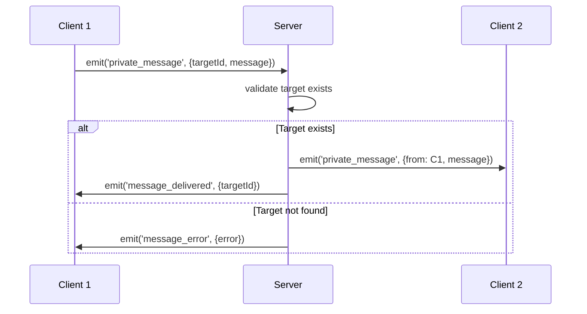

### 4.3 Flujo de Gestión de Salas

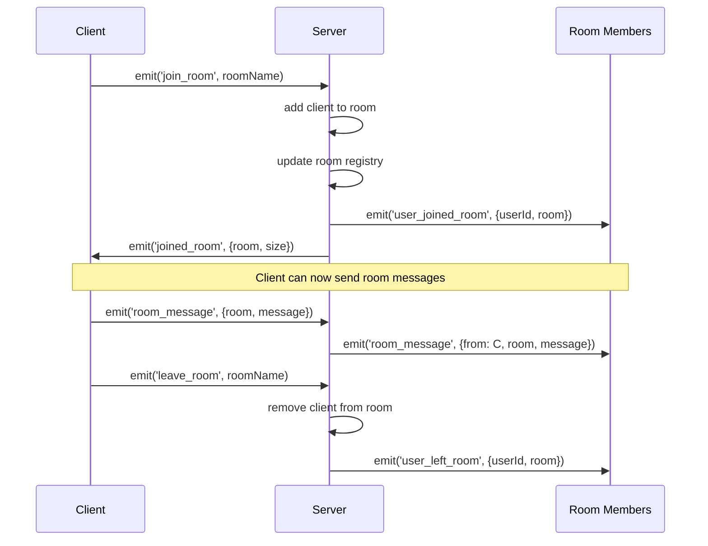

## 5. Modelo de Datos

### 5.1 Estructura de Datos en Memoria

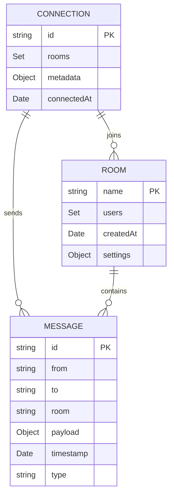

### 5.2 Eventos del Sistema

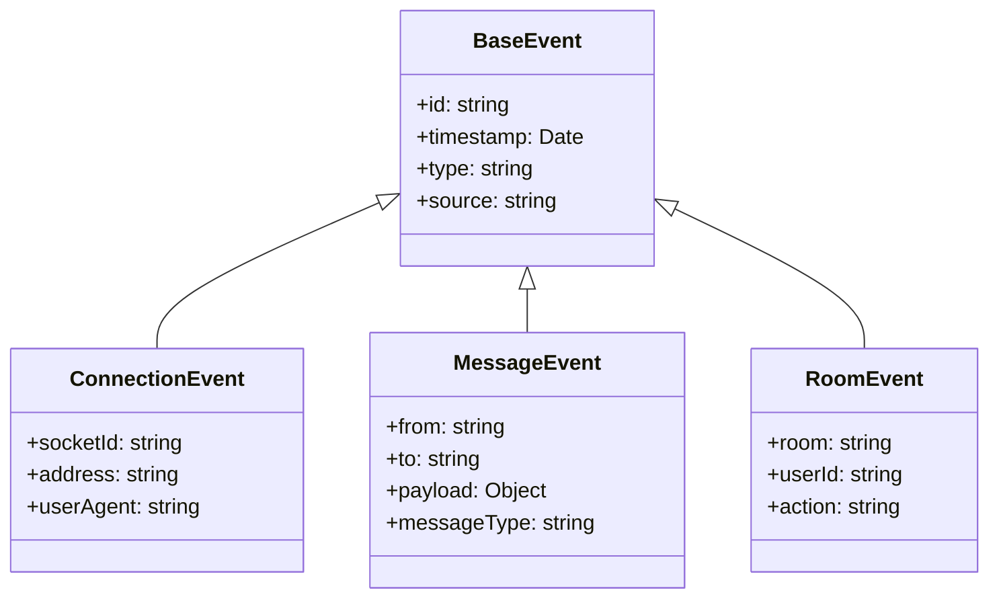

## 6. Seguridad y Autenticación

### 6.1 Modelo de Seguridad Actual (MVP)

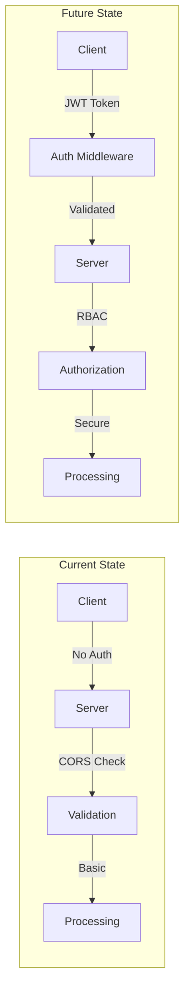

### 6.2 Consideraciones de Seguridad

#### 6.2.1 Vulnerabilidades Actuales
- Sin autenticación de usuarios
- Sin autorización por salas
- Sin rate limiting
- Sin validación exhaustiva de payloads

#### 6.2.2 Mitigaciones Planificadas
- JWT authentication
- Role-based access control
- Rate limiting por usuario/IP
- Input sanitization
- Message encryption (TLS)

## 7. Performance y Escalabilidad

### 7.1 Métricas de Performance

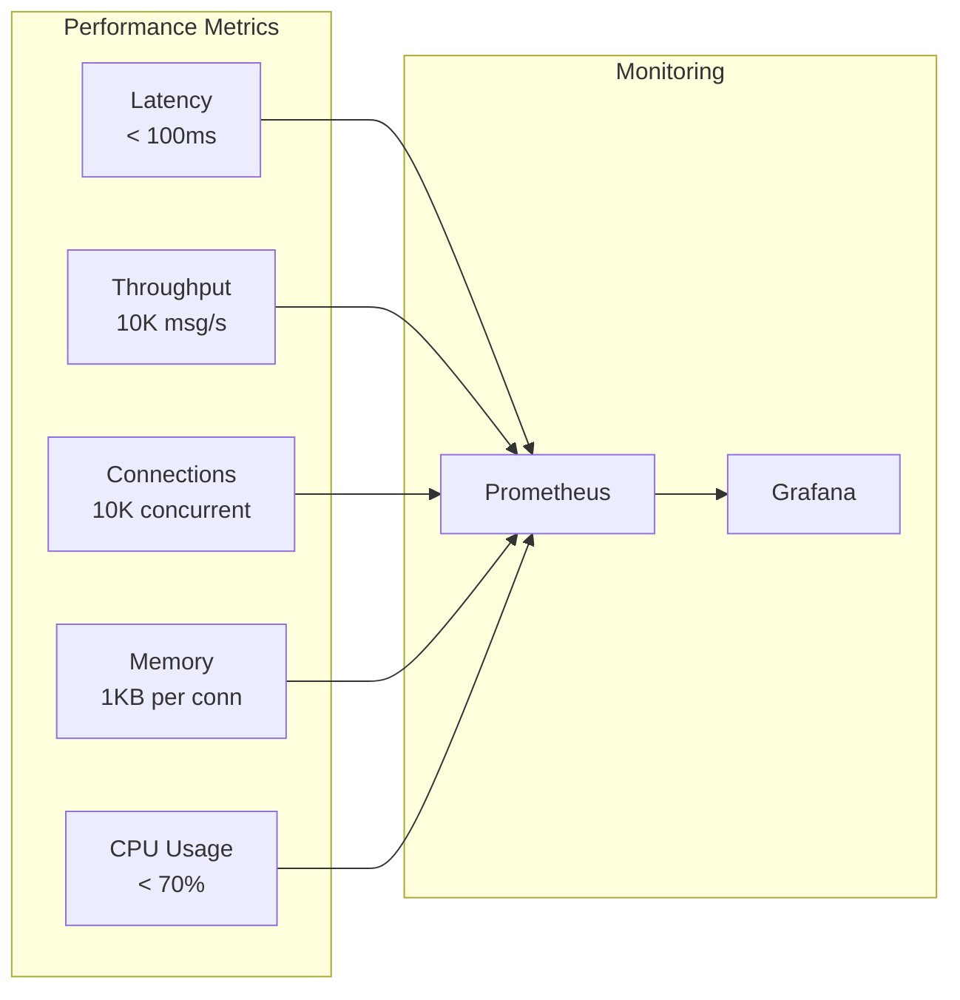

### 7.2 Estrategia de Escalabilidad

#### 7.2.1 Escalabilidad Vertical (Fase 1)
- Incremento de CPU/RAM en instancia única
- Optimización de algoritmos
- Memory pooling
- Connection pooling

#### 7.2.2 Escalabilidad Horizontal (Fase 2)

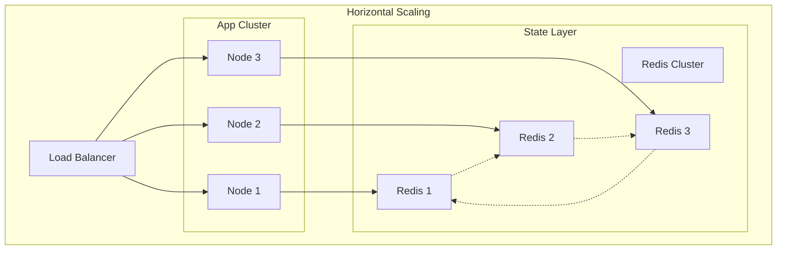

## 8. Deployment Architecture

### 8.1 Containerización

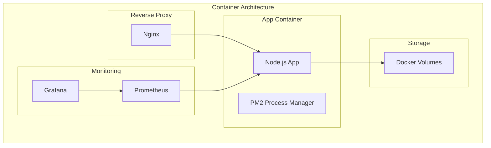

### 8.2 CI/CD Pipeline

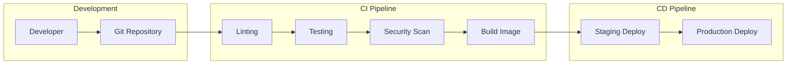

## 9. Monitoreo y Observabilidad

### 9.1 Logging Strategy

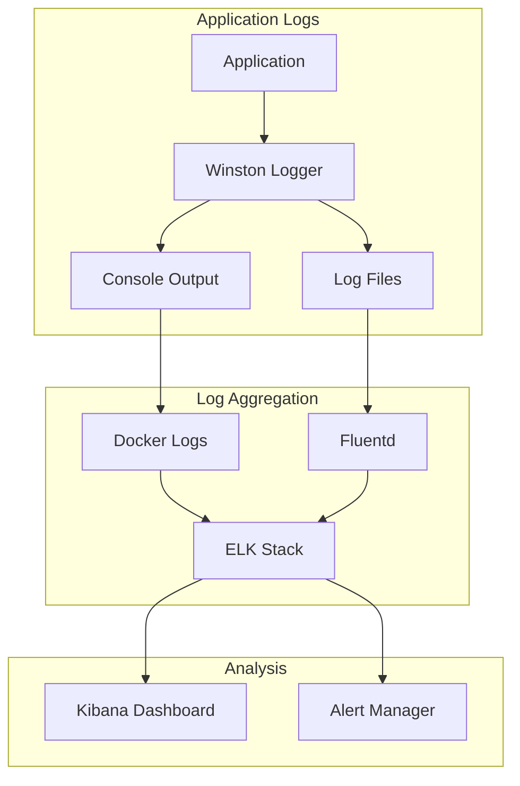

### 9.2 Health Checks

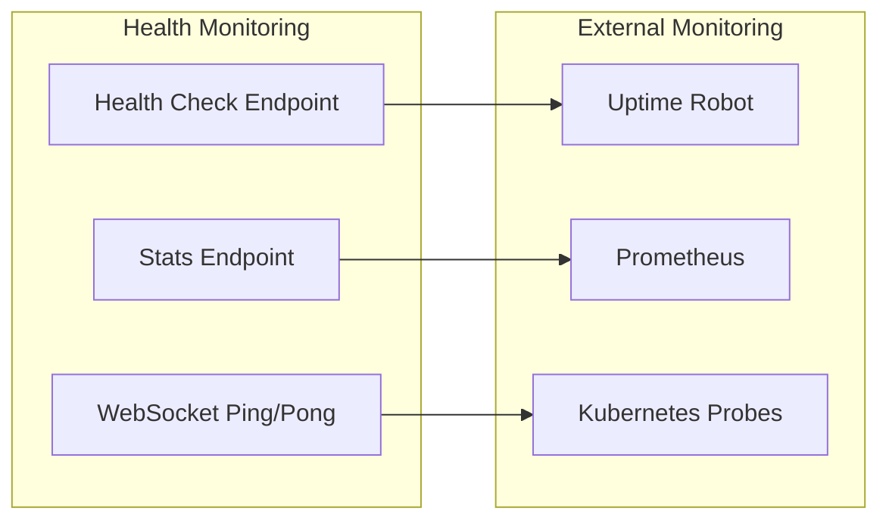

## 10. Consideraciones Futuras

### 10.1 Roadmap Arquitectónico

#### Fase 1 (Actual) - MVP
- ✅ WebSocket relay básico
- ✅ Gestión de salas
- ✅ Mensajes privados
- ✅ API REST básica

#### Fase 2 - Escalabilidad
- 🔄 Redis para estado distribuido
- 🔄 Load balancing
- 🔄 Authentication/Authorization
- 🔄 Rate limiting

#### Fase 3 - Enterprise
- ⏳ Message persistence
- ⏳ Multi-region deployment
- ⏳ Advanced monitoring
- ⏳ API versioning

### 10.2 Evolución de la Arquitectura

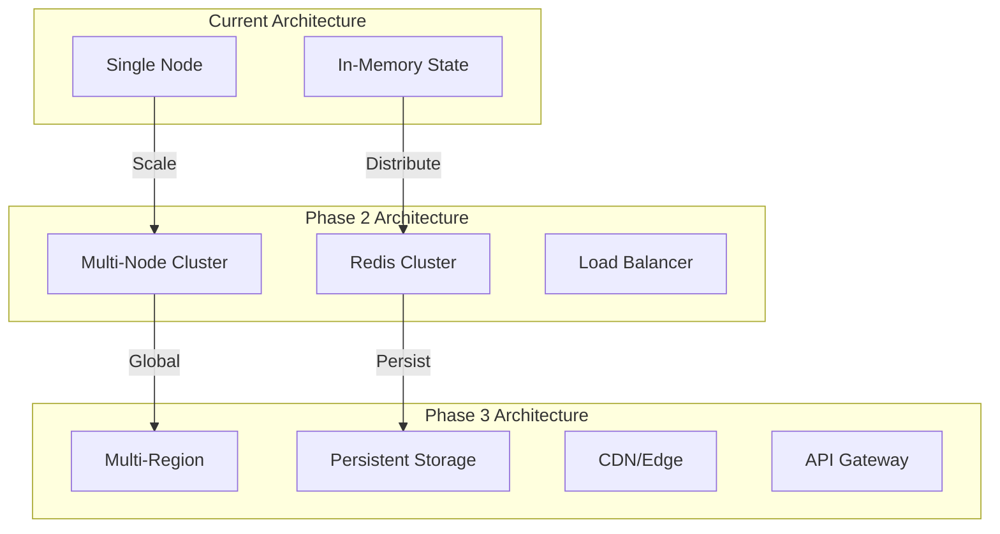

---

**Versión**: 1.0  
**Fecha**: ${new Date().toISOString()}  
**Estado**: En desarrollo  
**Próxima revisión**: +30 días