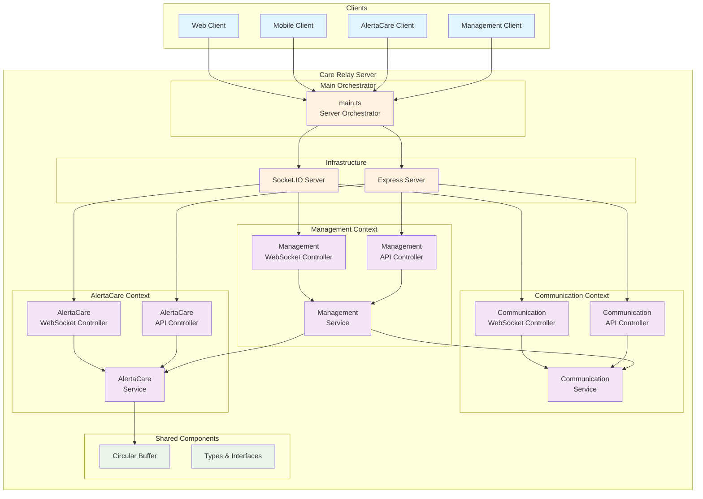
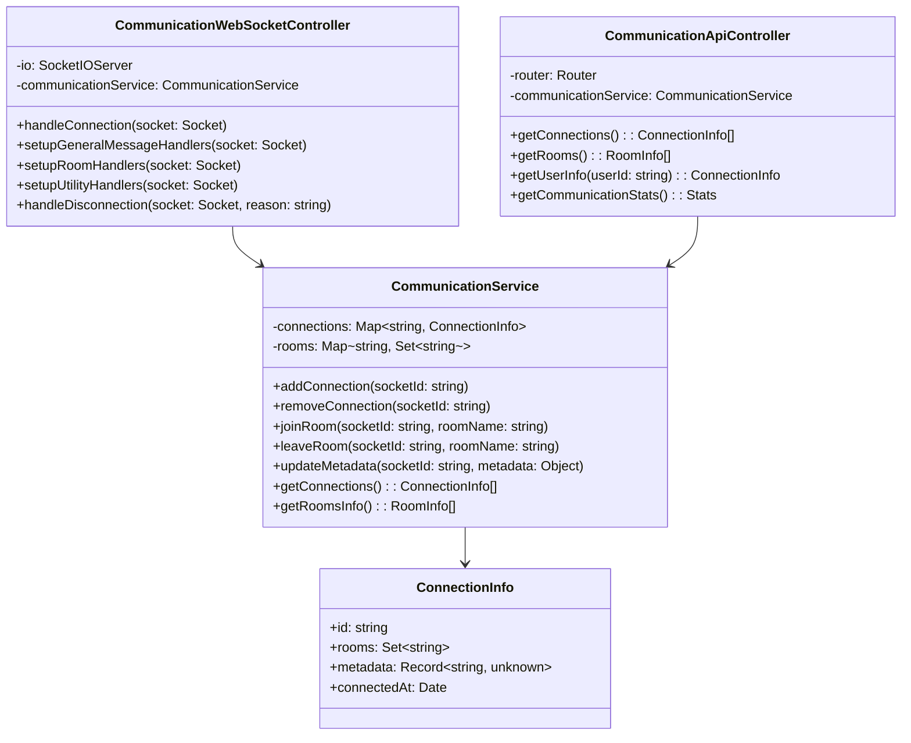
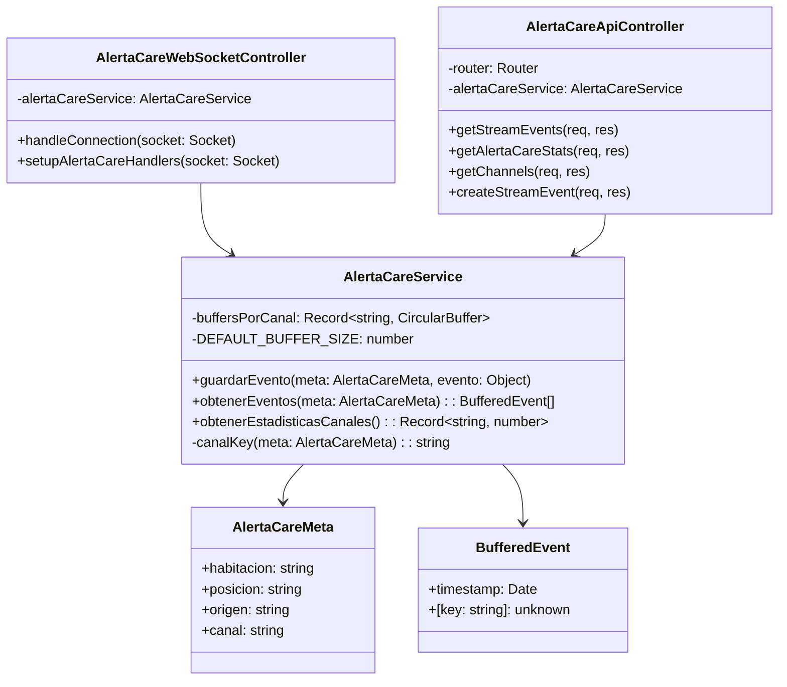
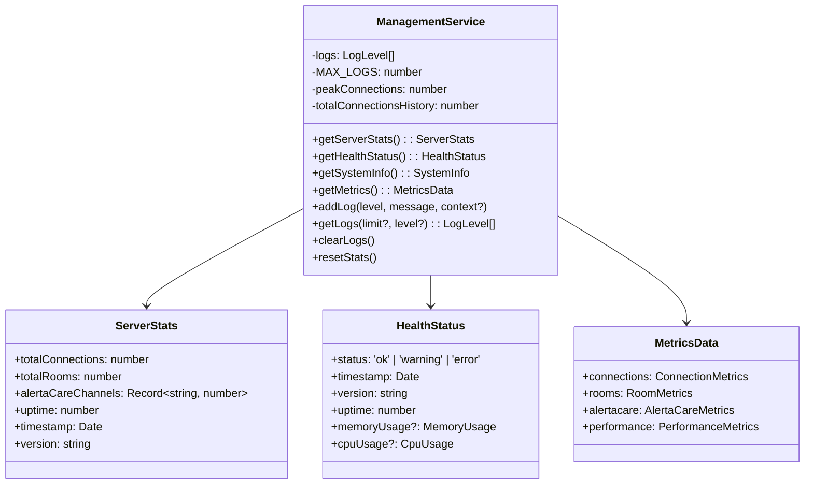
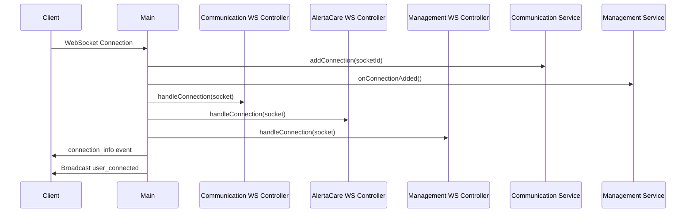
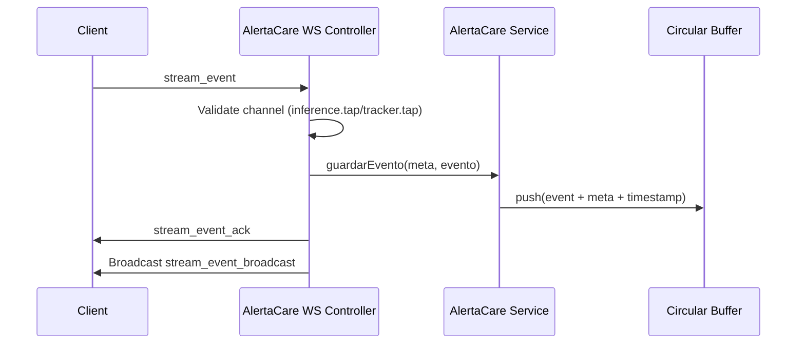

# Documento de Arquitectura - care-relay-r2

## 📋 Información del Documento

**Versión**: 2.0 (Refactorizada por Contextos)
**Fecha**: Diciembre 2024
**Estado**: Implementado y Operacional ✅

## ⚠️ NOTA DE SINCRONIZACIÓN
**Esta documentación está 100% sincronizada con el código implementado.**

**IMPLEMENTADO COMPLETAMENTE**:
- ✅ Arquitectura por Contextos (DDD)
- ✅ WebSocket Controllers por Contexto
- ✅ API REST Controllers por Contexto
- ✅ Servicios de Negocio Separados
- ✅ Sistema de Management Integrado
- ✅ Buffers Circulares para Alerta Care
- ✅ Logging Contextualizado
- ✅ Métricas y Monitoreo

## 1. Visión General de la Arquitectura

### 1.1 Propósito
Este documento define la arquitectura refactorizada del sistema **care-relay-r2**, un servidor de comunicación en tiempo real organizado por contextos de dominio, que facilita tanto la comunicación general entre clientes como el manejo especializado de eventos de telemetría médica.

### 1.2 Objetivos Arquitectónicos
- **Separación por Contextos**: Arquitectura DDD con bounded contexts claros
- **Escalabilidad**: Fácil extensión de funcionalidades por contexto
- **Mantenibilidad**: Código organizado y responsabilidades bien definidas
- **Observabilidad**: Logging contextualizado y métricas detalladas
- **Flexibilidad**: Controladores separados para WebSocket y API REST

## 2. Arquitectura por Contextos

### 2.1 Diagrama de Arquitectura General



### 2.2 Estructura de Directorios

```
src/
├── main.ts                                    # 🎯 Orchestador principal
├── shared/                                    # 🔄 Componentes compartidos
│   └── circularBuffer.ts                     # Buffer circular genérico
├── core/                                      # 📚 Lógica de negocio por contexto
│   ├── communication/                         # 💬 Contexto de Comunicación
│   │   ├── types.ts                          # Tipos de comunicación
│   │   ├── communicationService.ts           # Servicio de comunicación
│   │   └── index.ts                          # Exportaciones
│   ├── alertacare/                           # 🚨 Contexto de Alerta Care
│   │   ├── types.ts                          # Tipos de Alerta Care
│   │   ├── alertaCareService.ts              # Servicio de Alerta Care
│   │   └── index.ts                          # Exportaciones
│   └── management/                           # ⚙️ Contexto de Management
│       ├── types.ts                          # Tipos de management
│       ├── managementService.ts              # Servicio de management
│       └── index.ts                          # Exportaciones
└── infrastructure/                           # 🔌 Infraestructura
    ├── websocket/                            # Controladores WebSocket
    │   ├── communicationWebSocketController.ts
    │   ├── alertaCareWebSocketController.ts
    │   └── managementWebSocketController.ts
    └── api/                                  # Controladores API REST
        ├── communicationApiController.ts
        ├── alertaCareApiController.ts
        └── managementApiController.ts
```

## 3. Contextos de Dominio

### 3.1 Communication Context (💬)

**Responsabilidad**: Gestión de comunicación general entre clientes

#### 3.1.1 Componentes
- **CommunicationService**: Gestión de conexiones, salas y metadata
- **CommunicationWebSocketController**: Eventos WebSocket de comunicación
- **CommunicationApiController**: Endpoints REST de comunicación

#### 3.1.2 Diagrama de Clases



#### 3.1.3 API Endpoints

| Método | Endpoint | Descripción |
|--------|----------|-------------|
| GET | `/api/communication/connections` | Lista conexiones activas |
| GET | `/api/communication/rooms` | Información de salas |
| GET | `/api/communication/rooms/:roomName` | Info de sala específica |
| GET | `/api/communication/users/:userId` | Info de usuario específico |
| GET | `/api/communication/stats` | Estadísticas de comunicación |

#### 3.1.4 WebSocket Events

| Event | Dirección | Descripción |
|-------|-----------|-------------|
| `relay_message` | Cliente → Servidor | Mensaje general a todos |
| `relayed_message` | Servidor → Clientes | Retransmisión de mensaje |
| `private_message` | Cliente → Servidor | Mensaje privado |
| `join_room` | Cliente → Servidor | Unirse a sala |
| `leave_room` | Cliente → Servidor | Abandonar sala |
| `room_message` | Cliente → Servidor | Mensaje a sala |
| `get_connected_users` | Cliente → Servidor | Solicitar usuarios conectados |
| `connected_users` | Servidor → Cliente | Lista de usuarios |

### 3.2 Alerta Care Context (🚨)

**Responsabilidad**: Gestión de eventos de telemetría médica con buffers circulares

#### 3.2.1 Componentes
- **AlertaCareService**: Gestión de eventos y buffers por canal
- **AlertaCareWebSocketController**: Eventos WebSocket específicos
- **AlertaCareApiController**: Endpoints REST para consultas

#### 3.2.2 Canales Soportados
- `inference.tap`: Canal de eventos de inferencia
- `tracker.tap`: Canal de eventos de tracking

#### 3.2.3 Diagrama de Clases



#### 3.2.4 API Endpoints

| Método | Endpoint | Descripción |
|--------|----------|-------------|
| GET | `/api/alertacare/streams/:habitacion/:posicion/:origen/:canal/events` | Eventos de canal específico |
| GET | `/api/alertacare/stats` | Estadísticas de Alerta Care |
| GET | `/api/alertacare/channels` | Lista de canales activos |
| GET | `/api/alertacare/channels/:channelKey/events` | Eventos por channel key |
| POST | `/api/alertacare/streams/:habitacion/:posicion/:origen/:canal/events` | Crear evento (testing) |

#### 3.2.5 WebSocket Events

| Event | Dirección | Descripción |
|-------|-----------|-------------|
| `stream_event` | Cliente → Servidor | Envío de evento de stream |
| `stream_event_ack` | Servidor → Cliente | Confirmación de recepción |
| `stream_event_error` | Servidor → Cliente | Error en evento |
| `subscribe_channel` | Cliente → Servidor | Suscribirse a canal |
| `unsubscribe_channel` | Cliente → Servidor | Desuscribirse de canal |
| `get_channel_events` | Cliente → Servidor | Solicitar eventos de canal |

### 3.3 Management Context (⚙️)

**Responsabilidad**: Monitoreo, métricas y gestión del sistema

#### 3.3.1 Componentes
- **ManagementService**: Estadísticas, logs, métricas y salud del sistema
- **ManagementWebSocketController**: Eventos WebSocket de management
- **ManagementApiController**: Endpoints REST de administración

#### 3.3.2 Diagrama de Clases



#### 3.3.3 API Endpoints

| Método | Endpoint | Descripción |
|--------|----------|-------------|
| GET | `/api/management/stats` | Estadísticas del servidor |
| GET | `/api/management/health` | Estado de salud |
| GET | `/api/management/system` | Información del sistema |
| GET | `/api/management/metrics` | Métricas detalladas |
| GET | `/api/management/logs` | Logs del sistema |
| DELETE | `/api/management/logs` | Limpiar logs |
| POST | `/api/management/stats/reset` | Reset estadísticas |
| GET | `/api/management/diagnostics` | Diagnósticos completos |

## 4. Patrones Arquitectónicos

### 4.1 Domain-Driven Design (DDD)
- **Bounded Contexts**: Cada contexto tiene su dominio bien definido
- **Separation of Concerns**: Responsabilidades claras por contexto
- **Aggregate Root**: Servicios como punto de entrada a cada contexto

### 4.2 Hexagonal Architecture
- **Core Business Logic**: Servicios en `core/`
- **Infrastructure**: Controladores en `infrastructure/`
- **Shared Kernel**: Componentes compartidos en `shared/`

### 4.3 Event-Driven Architecture
- **WebSocket Events**: Comunicación asíncrona basada en eventos
- **Event Validation**: Validación específica por contexto
- **Event Logging**: Logging contextualizado por evento

## 5. Flujo de Datos

### 5.1 Flujo de Conexión WebSocket



### 5.2 Flujo de Evento de Stream



## 6. Ventajas de la Arquitectura Refactorizada

### 6.1 Escalabilidad
- **Contextos Independientes**: Cada contexto puede evolucionar independientemente
- **Controladores Separados**: WebSocket y API REST separados por responsabilidad
- **Servicios Especializados**: Lógica de negocio enfocada

### 6.2 Mantenibilidad
- **Código Organizado**: Estructura clara por dominio
- **Responsabilidades Claras**: Cada clase tiene una responsabilidad específica
- **Logging Contextualizado**: `[COMMUNICATION]`, `[ALERTA_CARE]`, `[MANAGEMENT]`

### 6.3 Testabilidad
- **Servicios Aislados**: Fácil creación de unit tests
- **Mocking Simplificado**: Dependencias claras entre componentes
- **Testing por Contexto**: Pruebas enfocadas por dominio

### 6.4 Observabilidad
- **Métricas Detalladas**: Por contexto y globales
- **Logs Estructurados**: Con contexto y niveles
- **Health Checks**: Estado detallado del sistema

## 7. Consideraciones de Deployment

### 7.1 Configuración
- **Variables de Entorno**: Puerto configurable
- **Logging**: Niveles configurables por contexto
- **Buffer Sizes**: Tamaños configurables por canal

### 7.2 Monitoreo
- **Health Endpoint**: `/api/management/health`
- **Metrics Endpoint**: `/api/management/metrics`
- **Real-time Metrics**: WebSocket subscription disponible

### 7.3 Performance
- **Memory Management**: Buffers circulares con límites
- **Connection Tracking**: Estadísticas en tiempo real
- **Resource Monitoring**: CPU y memoria integrados

## 8. Futuras Extensiones

### 8.1 Nuevos Contextos
- Fácil adición siguiendo el patrón establecido
- Servicios, controladores WebSocket y API independientes

### 8.2 Persistencia
- Integración de base de datos por contexto
- Mantenimiento del patrón arquitectónico

### 8.3 Autenticación
- Middleware por contexto
- Autorización granular por endpoint y evento 