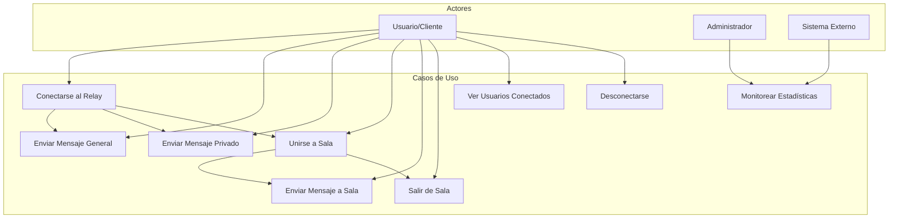

# Documento Funcional - care-relay-r1

## 1. Introducción

### 1.1 Propósito del Sistema
**care-relay-r1** es un sistema de relay de comunicación en tiempo real que permite a múltiples clientes conectarse y comunicarse entre sí a través de WebSockets, facilitando el intercambio de mensajes en tiempo real con soporte para comunicación grupal e individual.

### 1.2 Objetivos del Sistema
- Facilitar comunicación bidireccional en tiempo real entre múltiples clientes
- Proporcionar capacidades de relay y broadcasting de mensajes
- Soportar comunicación privada punto a punto
- Gestionar salas de chat temáticas
- Proveer monitoreo y estadísticas de conexiones

### 1.3 Alcance Funcional
**Incluye:**
- Relay de mensajes generales
- Mensajes privados entre usuarios
- Gestión de salas de chat
- Monitoreo de conexiones activas
- API REST para estadísticas
- Cliente web de demostración

**No Incluye:**
- Autenticación de usuarios
- Persistencia de mensajes
- Encriptación end-to-end
- Moderación de contenido

## 2. Casos de Uso Principales

### 2.1 Diagrama de Casos de Uso



### 2.2 Actores del Sistema

#### 2.2.1 Usuario/Cliente
- **Descripción**: Persona que utiliza el sistema para comunicarse
- **Responsabilidades**: Enviar y recibir mensajes, unirse a salas
- **Interacciones**: WebSocket connection, envío de eventos

#### 2.2.2 Administrador
- **Descripción**: Persona responsable del monitoreo del sistema
- **Responsabilidades**: Supervisar estadísticas, salud del sistema
- **Interacciones**: API REST, dashboards de monitoreo

#### 2.2.3 Sistema Externo
- **Descripción**: Aplicaciones que consumen las APIs del relay
- **Responsabilidades**: Integración con otros sistemas
- **Interacciones**: API REST, webhooks (futuro)

## 3. Funcionalidades Detalladas

### 3.1 Gestión de Conexiones

#### 3.1.1 Conectarse al Sistema
**Descripción**: Los usuarios se conectan al sistema mediante WebSocket.

**Flujo Principal**:
1. Cliente establece conexión WebSocket con el servidor
2. Servidor asigna un ID único al cliente
3. Cliente recibe confirmación de conexión exitosa
4. Cliente se registra con un nickname opcional
5. Sistema notifica a otros usuarios la nueva conexión (opcional)

**Eventos WebSocket**:
- `connection` - Conexión establecida
- `client_connected` - Notificación de nuevo cliente
- `assign_id` - Asignación de ID único

#### 3.1.2 Gestión de Identidad
**Descripción**: Asignación y gestión de identidad de usuarios conectados.

**Flujo Principal**:
1. Cliente envía evento `set_nickname`
2. Sistema valida el nickname (único, válido)
3. Sistema asigna o actualiza el nickname
4. Sistema confirma la asignación
5. Otros usuarios son notificados del cambio

**Validaciones**:
- Nickname debe ser único en el sistema
- Longitud mínima: 3 caracteres, máxima: 20
- Solo caracteres alfanuméricos y guiones

### 3.2 Comunicación de Mensajes

#### 3.2.1 Mensajes Generales (Broadcast)
**Descripción**: Envío de mensajes a todos los usuarios conectados.

**Flujo Principal**:
1. Cliente envía evento `broadcast_message`
2. Sistema valida el mensaje
3. Sistema retransmite el mensaje a todos los clientes conectados
4. Clientes reciben el mensaje con metadatos del emisor

**Estructura del Mensaje**:
```json
{
  "type": "broadcast_message",
  "sender_id": "client_123",
  "sender_nickname": "usuario1",
  "message": "Contenido del mensaje",
  "timestamp": "2024-01-01T12:00:00Z"
}
```

#### 3.2.2 Mensajes Privados
**Descripción**: Envío de mensajes directos entre dos usuarios.

**Flujo Principal**:
1. Cliente envía evento `private_message` con ID de destinatario
2. Sistema valida que el destinatario existe
3. Sistema envía el mensaje solo al destinatario
4. Destinatario recibe el mensaje privado

**Estructura del Mensaje**:
```json
{
  "type": "private_message",
  "sender_id": "client_123",
  "sender_nickname": "usuario1",
  "recipient_id": "client_456",
  "message": "Mensaje privado",
  "timestamp": "2024-01-01T12:00:00Z"
}
```

### 3.3 Gestión de Salas

#### 3.3.1 Crear/Unirse a Sala
**Descripción**: Los usuarios pueden crear salas temáticas o unirse a existentes.

**Flujo Principal**:
1. Cliente envía evento `join_room` con nombre de sala
2. Sistema crea la sala si no existe
3. Sistema agrega al cliente a la sala
4. Sistema notifica a miembros de la sala sobre el nuevo miembro
5. Cliente recibe confirmación y lista de miembros

#### 3.3.2 Mensajes en Sala
**Descripción**: Envío de mensajes a todos los miembros de una sala específica.

**Flujo Principal**:
1. Cliente envía evento `room_message` con nombre de sala
2. Sistema valida que el cliente pertenece a la sala
3. Sistema retransmite el mensaje a todos los miembros de la sala
4. Miembros reciben el mensaje con contexto de sala

#### 3.3.3 Salir de Sala
**Descripción**: Los usuarios pueden abandonar salas.

**Flujo Principal**:
1. Cliente envía evento `leave_room`
2. Sistema remueve al cliente de la sala
3. Sistema notifica a miembros restantes
4. Si la sala queda vacía, se elimina automáticamente

### 3.4 Monitoreo y Estadísticas

#### 3.4.1 API REST de Estadísticas
**Descripción**: Endpoint para consultar estadísticas del sistema.

**Endpoints**:
- `GET /api/stats` - Estadísticas generales
- `GET /api/clients` - Lista de clientes conectados
- `GET /api/rooms` - Lista de salas activas

**Respuesta de Estadísticas**:
```json
{
  "total_connections": 150,
  "active_rooms": 12,
  "messages_per_minute": 45,
  "uptime": "2d 4h 30m",
  "timestamp": "2024-01-01T12:00:00Z"
}
```

## 4. Casos de Uso Detallados

### 4.1 UC1 - Conectarse al Relay

**Descripción**: Un usuario establece conexión con el sistema de relay.

**Actor Principal**: Usuario/Cliente

**Precondiciones**:
- Cliente tiene acceso a internet
- Servidor está ejecutándose y disponible

**Flujo Principal**:
1. Usuario abre aplicación cliente
2. Sistema establece conexión WebSocket
3. Servidor asigna ID único al cliente
4. Usuario recibe confirmación de conexión
5. Usuario puede opcionalmente establecer nickname

**Postcondiciones**:
- Cliente conectado y registrado en el sistema
- Cliente puede enviar y recibir mensajes

**Flujos Alternativos**:
- **4a**: Error de conexión - Sistema muestra mensaje de error y reintenta
- **5a**: Nickname ya existe - Sistema solicita nickname alternativo

### 4.2 UC2 - Enviar Mensaje General

**Descripción**: Un usuario envía un mensaje a todos los usuarios conectados.

**Actor Principal**: Usuario/Cliente

**Precondiciones**:
- Usuario está conectado al sistema
- Usuario tiene permisos para enviar mensajes

**Flujo Principal**:
1. Usuario escribe mensaje en interfaz
2. Usuario presiona enviar
3. Sistema valida el mensaje
4. Sistema retransmite mensaje a todos los clientes
5. Todos los usuarios reciben el mensaje

**Postcondiciones**:
- Mensaje enviado a todos los usuarios conectados
- Mensaje visible en interfaz de todos los clientes

**Flujos Alternativos**:
- **3a**: Mensaje vacío - Sistema rechaza envío
- **3b**: Mensaje muy largo - Sistema trunca o rechaza
- **4a**: Error de red - Sistema reintenta envío

### 4.3 UC3 - Enviar Mensaje Privado

**Descripción**: Un usuario envía un mensaje directo a otro usuario específico.

**Actor Principal**: Usuario/Cliente

**Precondiciones**:
- Usuario está conectado al sistema
- Usuario destinatario está conectado
- Usuario conoce el ID o nickname del destinatario

**Flujo Principal**:
1. Usuario selecciona destinatario de la lista
2. Usuario escribe mensaje privado
3. Usuario envía mensaje
4. Sistema valida destinatario existe
5. Sistema envía mensaje solo al destinatario
6. Destinatario recibe notificación de mensaje privado

**Postcondiciones**:
- Mensaje entregado únicamente al destinatario
- Conversación privada establecida

**Flujos Alternativos**:
- **4a**: Destinatario no existe - Sistema notifica error
- **4b**: Destinatario desconectado - Sistema almacena temporalmente o notifica

### 4.4 UC4 - Unirse a Sala

**Descripción**: Un usuario se une a una sala de chat temática.

**Actor Principal**: Usuario/Cliente

**Precondiciones**:
- Usuario está conectado al sistema

**Flujo Principal**:
1. Usuario solicita unirse a sala específica
2. Sistema verifica si la sala existe
3. Si no existe, sistema crea la sala
4. Sistema agrega usuario a la sala
5. Sistema notifica a miembros existentes
6. Usuario recibe lista de miembros de la sala

**Postcondiciones**:
- Usuario es miembro de la sala
- Usuario puede participar en conversaciones de la sala

**Flujos Alternativos**:
- **2a**: Sala con límite de usuarios - Sistema verifica capacidad
- **4a**: Error al unirse - Sistema notifica problema

### 4.5 UC8 - Monitorear Estadísticas

**Descripción**: Un administrador consulta estadísticas del sistema.

**Actor Principal**: Administrador

**Precondiciones**:
- Administrador tiene acceso al sistema
- API REST está disponible

**Flujo Principal**:
1. Administrador accede al endpoint de estadísticas
2. Sistema recopila métricas actuales
3. Sistema devuelve datos estadísticos
4. Administrador visualiza información

**Postcondiciones**:
- Administrador tiene visibilidad del estado del sistema

## 5. Historias de Usuario

### 5.1 Historias de Comunicación Básica

#### HU-001: Conexión Simple
**Como** usuario final  
**Quiero** conectarme fácilmente al sistema de chat  
**Para** poder comunicarme con otros usuarios  

**Criterios de Aceptación**:
- Puedo conectarme con un solo clic
- Recibo confirmación visual de conexión exitosa
- Se me asigna un identificador único automáticamente
- Puedo establecer un nickname opcional

#### HU-002: Envío de Mensajes Públicos
**Como** usuario conectado  
**Quiero** enviar mensajes que todos puedan ver  
**Para** participar en conversaciones grupales  

**Criterios de Aceptación**:
- Puedo escribir mensajes de hasta 500 caracteres
- Los mensajes se envían al presionar Enter o botón Enviar
- Todos los usuarios conectados reciben mi mensaje
- Mi mensaje aparece con mi nickname y timestamp

#### HU-003: Mensajes Privados
**Como** usuario conectado  
**Quiero** enviar mensajes privados a usuarios específicos  
**Para** tener conversaciones personales  

**Criterios de Aceptación**:
- Puedo seleccionar un destinatario de la lista de usuarios
- Solo el destinatario recibe mi mensaje privado
- Los mensajes privados se distinguen visualmente de los públicos
- Puedo ver historial de conversación privada

### 5.2 Historias de Gestión de Salas

#### HU-004: Crear y Unirse a Salas
**Como** usuario conectado  
**Quiero** crear o unirme a salas temáticas  
**Para** participar en conversaciones específicas  

**Criterios de Aceptación**:
- Puedo crear una nueva sala con un nombre único
- Puedo unirme a salas existentes
- Veo la lista de miembros de la sala
- Recibo notificación cuando alguien se une o sale

#### HU-005: Mensajes en Salas
**Como** miembro de una sala  
**Quiero** enviar mensajes solo a miembros de esa sala  
**Para** mantener conversaciones organizadas por tema  

**Criterios de Aceptación**:
- Mis mensajes en sala solo los ven miembros de esa sala
- Puedo identificar en qué sala estoy escribiendo
- Puedo estar en múltiples salas simultáneamente
- Puedo cambiar entre salas fácilmente

### 5.3 Historias de Monitoreo

#### HU-006: Vista de Usuarios Conectados
**Como** usuario conectado  
**Quiero** ver qué otros usuarios están en línea  
**Para** saber con quién puedo comunicarme  

**Criterios de Aceptación**:
- Veo lista actualizada de usuarios conectados
- La lista se actualiza automáticamente cuando usuarios se conectan/desconectan
- Puedo ver nicknames de usuarios
- Puedo identificar usuarios disponibles para mensajes privados

#### HU-007: Estadísticas para Administradores
**Como** administrador del sistema  
**Quiero** ver estadísticas de uso del relay  
**Para** monitorear el rendimiento y uso del sistema  

**Criterios de Aceptación**:
- Puedo ver número total de conexiones activas
- Puedo ver número de salas activas
- Puedo ver tasa de mensajes por minuto
- Puedo ver tiempo de actividad del servidor
- Los datos se actualizan en tiempo real

### 5.4 Historias de Experiencia de Usuario

#### HU-008: Interfaz Intuitiva
**Como** nuevo usuario  
**Quiero** una interfaz fácil de usar  
**Para** comenzar a chatear sin necesidad de tutorial  

**Criterios de Aceptación**:
- La interfaz es auto-explicativa
- Los botones y controles son claramente etiquetados
- Hay indicadores visuales claros del estado de conexión
- La aplicación funciona en dispositivos móviles y desktop

#### HU-009: Notificaciones en Tiempo Real
**Como** usuario activo  
**Quiero** recibir notificaciones inmediatas de mensajes  
**Para** no perder información importante  

**Criterios de Aceptación**:
- Recibo mensajes instantáneamente sin retrasos perceptibles
- Hay indicadores visuales para mensajes no leídos
- Puedo distinguir entre diferentes tipos de mensajes
- Las notificaciones persisten hasta que las marco como leídas

## 6. Especificaciones Técnicas

### 6.1 Eventos WebSocket

#### 6.1.1 Eventos del Cliente al Servidor
```javascript
// Establecer nickname
{
  "type": "set_nickname",
  "nickname": "mi_usuario"
}

// Mensaje general
{
  "type": "broadcast_message",
  "message": "Hola a todos"
}

// Mensaje privado
{
  "type": "private_message",
  "recipient_id": "client_123",
  "message": "Mensaje privado"
}

// Unirse a sala
{
  "type": "join_room",
  "room_name": "javascript-devs"
}

// Enviar mensaje a sala
{
  "type": "room_message",
  "room_name": "javascript-devs",
  "message": "Hola sala"
}

// Salir de sala
{
  "type": "leave_room",
  "room_name": "javascript-devs"
}

// Solicitar lista de usuarios
{
  "type": "get_clients"
}
```

#### 6.1.2 Eventos del Servidor al Cliente
```javascript
// Confirmación de conexión
{
  "type": "connection_confirmed",
  "client_id": "client_123",
  "message": "Conexión establecida"
}

// Mensaje general recibido
{
  "type": "broadcast_message",
  "sender_id": "client_456",
  "sender_nickname": "otro_usuario",
  "message": "Hola a todos",
  "timestamp": "2024-01-01T12:00:00Z"
}

// Mensaje privado recibido
{
  "type": "private_message",
  "sender_id": "client_456",
  "sender_nickname": "otro_usuario",
  "message": "Mensaje privado",
  "timestamp": "2024-01-01T12:00:00Z"
}

// Lista de usuarios conectados
{
  "type": "clients_list",
  "clients": [
    {
      "id": "client_123",
      "nickname": "usuario1",
      "connected_at": "2024-01-01T11:30:00Z"
    }
  ]
}

// Notificación de sala
{
  "type": "room_notification",
  "room_name": "javascript-devs",
  "message": "usuario1 se ha unido a la sala",
  "members": ["usuario1", "usuario2"]
}
```

### 6.2 API REST

#### 6.2.1 Endpoints de Estadísticas
```
GET /api/stats
Content-Type: application/json

Response:
{
  "total_connections": 150,
  "active_rooms": 12,
  "messages_per_minute": 45,
  "uptime_seconds": 185400,
  "server_version": "1.0.0",
  "timestamp": "2024-01-01T12:00:00Z"
}
```

#### 6.2.2 Endpoints de Clientes
```
GET /api/clients
Content-Type: application/json

Response:
{
  "total_clients": 150,
  "clients": [
    {
      "id": "client_123",
      "nickname": "usuario1",
      "connected_at": "2024-01-01T11:30:00Z",
      "rooms": ["general", "javascript-devs"]
    }
  ]
}
```

#### 6.2.3 Endpoints de Salas
```
GET /api/rooms
Content-Type: application/json

Response:
{
  "total_rooms": 12,
  "rooms": [
    {
      "name": "javascript-devs",
      "member_count": 15,
      "created_at": "2024-01-01T10:00:00Z",
      "last_activity": "2024-01-01T11:59:00Z"
    }
  ]
}
```

## 7. Criterios de Aceptación del Sistema

### 7.1 Rendimiento
- El sistema debe soportar al menos 1000 conexiones concurrentes
- Latencia de mensajes menor a 100ms en condiciones normales
- Tiempo de respuesta de API REST menor a 200ms
- Disponibilidad del sistema mayor al 99.5%

### 7.2 Funcionalidad
- Todos los eventos WebSocket deben funcionar correctamente
- Mensajes no deben perderse en condiciones normales de red
- Sistema debe recuperarse automáticamente de errores menores
- API REST debe devolver datos actualizados y precisos

### 7.3 Usabilidad
- Interfaz debe ser responsiva en dispositivos móviles y desktop
- Conexión debe establecerse en menos de 3 segundos
- Usuarios deben poder enviar mensajes inmediatamente después de conectarse
- Indicadores de estado deben ser claros y precisos

### 7.4 Escalabilidad
- Arquitectura debe permitir agregar más instancias del servidor
- Base de datos (si se implementa) debe soportar crecimiento de usuarios
- Sistema de monitoreo debe escalar con el número de conexiones

## 8. Consideraciones Futuras

### 8.1 Mejoras Planificadas
- Implementación de autenticación de usuarios
- Persistencia de historial de mensajes
- Encriptación end-to-end para mensajes privados
- Sistema de moderación y filtros de contenido
- Soporte para archivos multimedia
- Integración con sistemas de notificaciones push

### 8.2 Escalabilidad
- Implementación de múltiples instancias del servidor
- Balanceador de carga para WebSockets
- Base de datos distribuida para alta disponibilidad
- Cache distribuido para mejorar rendimiento

### 8.3 Seguridad
- Implementación de rate limiting
- Validación robusta de entrada de datos
- Logs de seguridad y auditoría
- Protección contra ataques DDoS
- Sanitización de mensajes para prevenir XSS

---

**Documento Versión**: 1.0  
**Fecha de Última Actualización**: 2024-01-01  
**Estado**: Borrador para Revisión
