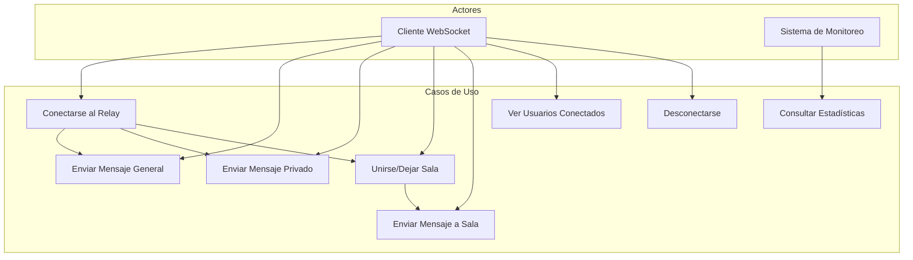

# Documento Funcional - care-relay-r1

## NOTA IMPORTANTE:
Esta versión de care-relay-r1 está alineada 100% con el código actual en server.js.

**Alcance Real de esta Versión:**
- ✅ Relay de mensajes genéricos entre clientes
- ✅ Mensajes privados punto a punto
- ✅ Gestión básica de salas (rooms)
- ✅ Monitoreo de conexiones activas
- ✅ API REST básica para estadísticas

**No Incluye (Out of Scope para esta versión):**
- ❌ Nicknames (solo se usan IDs de socket)
- ❌ Autenticación de usuarios
- ❌ Validación estricta de mensajes
- ❌ Persistencia de mensajes
- ❌ Buffers circulares
- ❌ Canales semánticos
- ❌ Encriptación de mensajes
- ❌ Moderación de contenido

## 1. Introducción

### 1.1 Propósito del Sistema
**care-relay-r1** es un sistema de relay de comunicación en tiempo real que permite a múltiples clientes conectarse y comunicarse entre sí a través de WebSockets, facilitando el intercambio de mensajes en tiempo real con soporte para comunicación grupal e individual.

### 1.2 Objetivos del Sistema
- Facilitar comunicación bidireccional en tiempo real entre múltiples clientes
- Proporcionar capacidades de relay y broadcasting de mensajes
- Soportar comunicación privada punto a punto
- Gestionar salas de chat básicas
- Proveer monitoreo básico de conexiones

### 1.3 Características Clave
- Conexión directa vía WebSocket
- Mensajería en tiempo real sin estado
- Salas de chat temporales (en memoria)
- Monitoreo básico del estado del servidor

## 2. Casos de Uso Principales

### 2.1 Diagrama de Casos de Uso



### 2.2 Actores del Sistema

#### 2.2.1 Cliente WebSocket
- **Descripción**: Aplicación que se conecta al servidor vía WebSocket
- **Responsabilidades**: Establecer conexión, enviar/recibir mensajes, gestionar salas
- **Interacciones**: Conexión WebSocket, eventos de mensajería

#### 2.2.2 Sistema de Monitoreo
- **Descripción**: Sistema que monitorea el estado del servidor
- **Responsabilidades**: Consultar estadísticas, verificar salud
- **Interacciones**: API REST (/stats, /health)

## 3. Funcionalidades Detalladas

### 3.1 Gestión de Conexiones

#### 3.1.1 Conectarse al Sistema
**Descripción**: Los clientes se conectan al sistema mediante WebSocket.

**Flujo Principal**:
1. Cliente establece conexión WebSocket con el servidor
2. Servidor asigna un ID único de socket al cliente
3. Cliente recibe evento `connection_info` con su ID
4. Se notifica a otros clientes mediante `user_connected`

**Eventos WebSocket**:
- `connection` - Conexión establecida (manejo interno)
- `connection_info` - Enviado al cliente con su ID único
- `user_connected` - Notificación a otros clientes de nueva conexión
- `user_disconnected` - Notificación cuando un cliente se desconecta

#### 3.1.2 Gestión de Identidad
**Descripción**: Identificación básica de clientes conectados.

**Características**:
- Cada cliente recibe un ID único de socket al conectarse
- No hay soporte para nicknames en esta versión
- Los clientes pueden adjuntar metadatos opcionales mediante `update_metadata`

**Eventos relacionados**:
- `update_metadata` - Para actualizar metadatos del cliente
- `user_metadata_updated` - Notificación a otros clientes de actualización

### 3.2 Comunicación de Mensajes

#### 3.2.1 Mensajes Generales (Broadcast)
**Descripción**: Envío de mensajes a todos los usuarios conectados.

**Flujo Principal**:
1. Cliente envía evento `relay_message` con los datos a transmitir
2. El servidor retransmite el mensaje a todos los clientes excepto al emisor
3. Los clientes reciben el mensaje en el evento `relayed_message`

**Estructura del Mensaje (Envío)**:
```javascript
// Cliente envía:
socket.emit('relay_message', {
  // Cualquier dato que se desee transmitir
  text: "Hola a todos",
  type: "mensaje_general"
});

// Clientes reciben:
{
  "from": "socket_id_del_remitente",
  "data": {
    "text": "Hola a todos",
    "type": "mensaje_general"
  },
  "timestamp": "2024-01-01T12:00:00.000Z"
}
```

#### 3.2.2 Mensajes Privados
**Descripción**: Envío de mensajes directos entre dos clientes.

**Flujo Principal**:
1. Cliente envía evento `private_message` con ID de destinatario y mensaje
2. Sistema valida que el destinatario existe
3. Sistema envía el mensaje solo al destinatario
4. Emisor recibe confirmación de entrega con `message_delivered`
5. Si el destinatario no existe, se envía `message_error` al emisor

**Estructura del Mensaje**:
```javascript
// Cliente envía:
socket.emit('private_message', {
  targetId: "socket_id_destinatario",
  message: "Hola, este es un mensaje privado"
});

// Destinatario recibe:
{
  "from": "socket_id_remitente",
  "message": "Hola, este es un mensaje privado",
  "timestamp": "2024-01-01T12:00:00.000Z"
}

// Confirmación al emisor (éxito):
{
  "targetId": "socket_id_destinatario",
  "timestamp": "2024-01-01T12:00:00.001Z"
}

// Error al emisor (fallo):
{
  "error": "Usuario no encontrado",
  "targetId": "socket_id_inexistente"
}
```

### 3.3 Gestión de Salas

#### 3.3.1 Unirse a Sala
**Descripción**: Los clientes pueden unirse a salas por nombre.

**Flujo Principal**:
1. Cliente envía evento `join_room` con nombre de sala
2. Sistema crea la sala si no existe
3. Sistema agrega al cliente a la sala
4. Cliente recibe confirmación con `joined_room`
5. Otros miembros de la sala reciben notificación con `user_joined_room`

**Estructura de Eventos**:
```javascript
// Cliente envía:
socket.emit('join_room', 'nombre_sala');

// Cliente recibe (confirmación):
{
  "room": "nombre_sala",
  "roomSize": 3  // Número de miembros en la sala
}

// Otros miembros reciben:
{
  "userId": "nuevo_miembro_id",
  "room": "nombre_sala",
  "roomSize": 3
}
```

#### 3.3.2 Mensajes en Sala
**Descripción**: Envío de mensajes a todos los miembros de una sala.

**Flujo Principal**:
1. Cliente envía evento `room_message` con nombre de sala y mensaje
2. Sistema retransmite el mensaje a todos los miembros de la sala excepto al emisor
3. Miembros reciben el mensaje en el evento `room_message`

**Estructura de Mensajes**:
```javascript
// Cliente envía:
socket.emit('room_message', {
  room: 'nombre_sala',
  message: 'Hola a todos en la sala!'
});

// Miembros reciben:
{
  "from": "socket_id_remitente",
  "room": "nombre_sala",
  "message": "Hola a todos en la sala!",
  "timestamp": "2024-01-01T12:00:00.000Z"
}
```

#### 3.3.3 Salir de Sala
**Descripción**: Los clientes pueden abandonar salas.

**Flujo Principal**:
1. Cliente envía evento `leave_room` con nombre de sala
2. Sistema remueve al cliente de la sala
3. Otros miembros de la sala reciben notificación con `user_left_room`
4. Si la sala queda vacía, se elimina automáticamente

**Estructura de Eventos**:
```javascript
// Cliente envía:
socket.emit('leave_room', 'nombre_sala');

// No hay confirmación directa, pero se puede verificar con 'get_rooms_info'

// Otros miembros reciben:
{
  "userId": "id_cliente_saliente",
  "room": "nombre_sala",
  "roomSize": 2  // Nuevo tamaño de la sala
}
```

### 3.4 Monitoreo y Consultas

#### 3.4.1 Obtener Usuarios Conectados
**Descripción**: Consulta la lista de clientes conectados.

**Eventos WebSocket**:
```javascript
// Cliente envía:
socket.emit('get_connected_users');

// Cliente recibe:
{
  "users": [
    {
      "id": "socket_id_1",
      "rooms": ["sala1", "sala2"],
      "metadata": {},
      "connectedAt": "2024-01-01T12:00:00.000Z"
    },
    // ... más usuarios
  ]
}
```

#### 3.4.2 Obtener Información de Salas
**Descripción**: Consulta información sobre las salas activas.

**Eventos WebSocket**:
```javascript
// Cliente envía:
socket.emit('get_rooms_info');

// Cliente recibe:
{
  "rooms": [
    {
      "name": "sala1",
      "userCount": 3,
      "users": ["socket_id_1", "socket_id_2", "socket_id_3"]
    },
    // ... más salas
  ]
}
```

#### 3.4.3 API REST de Estadísticas
**Descripción**: Endpoints REST para monitoreo del sistema.

**GET /health**
- **Descripción**: Verifica que el servidor esté en funcionamiento
- **Respuesta**:
  ```json
  {
    "status": "ok",
    "timestamp": "2024-01-01T12:00:00.000Z"
  }
  ```

**GET /stats**
- **Descripción**: Obtiene estadísticas del servidor
- **Respuesta**:
  ```json
  {
    "totalConnections": 5,
    "totalRooms": 2,
    "uptime": 1234.56,
    "timestamp": "2024-01-01T12:00:00.000Z"
  }
  ```

**Características de la API REST Actual**:
- Solo 2 endpoints disponibles: `/health` y `/stats`
- Respuesta en JSON simple
- No autenticación ni validaciones
- Datos en tiempo real desde memoria

## 4. Casos de Uso Detallados

### 4.1 UC1 - Conectarse al Relay

**Descripción**: Un usuario establece conexión con el sistema de relay.

**Actor Principal**: Usuario/Cliente

**Precondiciones**:
- Cliente tiene acceso a internet
- Servidor está ejecutándose y disponible

**Flujo Principal**:
1. Usuario abre aplicación cliente
2. Sistema establece conexión WebSocket
3. Servidor asigna ID único al cliente
4. Usuario recibe confirmación de conexión mediante `connection_info`
5. Usuario puede opcionalmente actualizar metadatos con `update_metadata`

**Postcondiciones**:
- Cliente conectado y registrado en el sistema
- Cliente puede enviar y recibir mensajes
- Cliente tiene un ID único de socket asignado

**Flujos Alternativos**:
- **4a**: Error de conexión - Sistema muestra mensaje de error y reintenta

### 4.2 UC2 - Enviar Mensaje General

**Descripción**: Un usuario envía un mensaje a todos los usuarios conectados.

**Actor Principal**: Usuario/Cliente

**Precondiciones**:
- Usuario está conectado al sistema
- Usuario tiene permisos para enviar mensajes

**Flujo Principal**:
1. Usuario escribe mensaje en interfaz
2. Usuario presiona enviar
3. Cliente envía evento `relay_message` con los datos
4. Sistema retransmite mensaje a todos los clientes excepto al emisor
5. Clientes reciben el mensaje en evento `relayed_message`

**Postcondiciones**:
- Mensaje enviado a todos los usuarios conectados excepto al emisor
- Mensaje visible en interfaz de todos los clientes receptores

**Flujos Alternativos**:
- **4a**: Error de red - Conexión se reintenta automáticamente

### 4.3 UC3 - Enviar Mensaje Privado

**Descripción**: Un usuario envía un mensaje directo a otro usuario específico.

**Actor Principal**: Usuario/Cliente

**Precondiciones**:
- Usuario está conectado al sistema
- Usuario destinatario está conectado
- Usuario conoce el socket ID del destinatario

**Flujo Principal**:
1. Usuario selecciona destinatario por su socket ID
2. Usuario escribe mensaje privado
3. Cliente envía evento `private_message` con targetId y message
4. Sistema valida que el destinatario existe
5. Sistema envía mensaje solo al destinatario
6. Emisor recibe confirmación con `message_delivered`

**Postcondiciones**:
- Mensaje entregado únicamente al destinatario
- Emisor confirmado de entrega exitosa

**Flujos Alternativos**:
- **4a**: Destinatario no existe - Emisor recibe `message_error`

### 4.4 UC4 - Unirse a Sala

**Descripción**: Un usuario se une a una sala de chat temática.

**Actor Principal**: Usuario/Cliente

**Precondiciones**:
- Usuario está conectado al sistema

**Flujo Principal**:
1. Cliente envía evento `join_room` con nombre de sala
2. Sistema crea la sala si no existe
3. Sistema agrega al cliente a la sala
4. Cliente recibe confirmación con `joined_room`
5. Otros miembros reciben notificación con `user_joined_room`
6. Cliente puede consultar información de salas con `get_rooms_info`

**Postcondiciones**:
- Usuario es miembro de la sala
- Usuario puede enviar/recibir mensajes en la sala
- Sala existe en el Map de rooms del servidor

**Flujos Alternativos**:
- **3a**: Error de conexión - Eventos pueden perderse temporalmente

### 4.5 UC8 - Monitorear Estadísticas

**Descripción**: Un sistema externo consulta estadísticas del servidor.

**Actor Principal**: Sistema de Monitoreo/Cliente HTTP

**Precondiciones**:
- Servidor está ejecutándose
- Cliente puede hacer peticiones HTTP GET

**Flujo Principal**:
1. Cliente hace GET request a `/stats` o `/health`
2. Sistema recopila métricas de memoria (connections, rooms, uptime)
3. Sistema responde con JSON containing estadísticas actuales

**Postcondiciones**:
- Cliente tiene visibilidad del estado actual del sistema en tiempo real

## 5. Historias de Usuario

### 5.1 Historias de Comunicación Básica

#### HU-001: Conexión Simple
**Como** usuario final  
**Quiero** conectarme fácilmente al sistema de chat  
**Para** poder comunicarme con otros usuarios  

**Criterios de Aceptación**:
- Puedo conectarme introduciendo la URL del servidor
- Recibo confirmación visual de conexión exitosa
- Se me asigna un socket ID único automáticamente
- No hay soporte para nicknames en esta versión (solo socket IDs)

#### HU-002: Envío de Mensajes Públicos
**Como** usuario conectado  
**Quiero** enviar mensajes que todos puedan ver  
**Para** participar en conversaciones grupales  

**Criterios de Aceptación**:
- Puedo escribir cualquier mensaje (sin límite de caracteres estricto)
- Los mensajes se envían al presionar Enter o botón Enviar
- Todos los usuarios conectados excepto yo reciben mi mensaje
- Mi mensaje aparece con mi socket ID y timestamp del servidor

#### HU-003: Mensajes Privados
**Como** usuario conectado  
**Quiero** enviar mensajes privados a usuarios específicos  
**Para** tener conversaciones personales  

**Criterios de Aceptación**:
- Puedo introducir manualmente el socket ID del destinatario
- Solo el destinatario recibe mi mensaje privado
- Recibo confirmación de entrega o error si el usuario no existe
- No hay persistencia de historial (todo se pierde al refrescar)

### 5.2 Historias de Gestión de Salas

#### HU-004: Crear y Unirse a Salas
**Como** usuario conectado  
**Quiero** crear o unirme a salas temáticas  
**Para** participar en conversaciones específicas  

**Criterios de Aceptación**:
- Puedo crear una nueva sala con un nombre único
- Puedo unirme a salas existentes
- Veo la lista de miembros de la sala
- Recibo notificación cuando alguien se une o sale

#### HU-005: Mensajes en Salas
**Como** miembro de una sala  
**Quiero** enviar mensajes solo a miembros de esa sala  
**Para** mantener conversaciones organizadas por tema  

**Criterios de Aceptación**:
- Mis mensajes en sala solo los ven miembros de esa sala
- Puedo identificar en qué sala estoy escribiendo
- Puedo estar en múltiples salas simultáneamente
- Puedo cambiar entre salas fácilmente

### 5.3 Historias de Monitoreo

#### HU-006: Vista de Usuarios Conectados
**Como** usuario conectado  
**Quiero** ver qué otros usuarios están en línea  
**Para** saber con quién puedo comunicarme  

**Criterios de Aceptación**:
- Puedo solicitar lista de usuarios mediante botón "Actualizar Lista"
- La lista muestra socket IDs de usuarios conectados
- Puedo ver en qué salas está cada usuario
- Debo solicitar manualmente actualizaciones (no es automático)

#### HU-007: Estadísticas para Administradores
**Como** administrador del sistema  
**Quiero** ver estadísticas de uso del relay  
**Para** monitorear el rendimiento y uso del sistema  

**Criterios de Aceptación**:
- Puedo hacer GET a `/stats` para ver conexiones y salas activas
- Puedo hacer GET a `/health` para verificar que el servidor funciona
- Puedo ver uptime del servidor en segundos
- No hay métricas de mensajes por minuto (no se miden)
- Los datos reflejan el estado actual al momento de la consulta

### 5.4 Historias de Experiencia de Usuario

#### HU-008: Interfaz Intuitiva
**Como** nuevo usuario  
**Quiero** una interfaz fácil de usar  
**Para** comenzar a chatear sin necesidad de tutorial  

**Criterios de Aceptación**:
- La interfaz es auto-explicativa
- Los botones y controles son claramente etiquetados
- Hay indicadores visuales claros del estado de conexión
- La aplicación funciona en dispositivos móviles y desktop

#### HU-009: Notificaciones en Tiempo Real
**Como** usuario activo  
**Quiero** recibir notificaciones inmediatas de mensajes  
**Para** no perder información importante  

**Criterios de Aceptación**:
- Recibo mensajes instantáneamente sin retrasos perceptibles
- Los mensajes se distinguen por tipo (general, privado, sala, sistema)
- Los mensajes se muestran con timestamp
- No hay persistencia de estado entre recargas de página

## 6. Especificaciones Técnicas - SOLO LO QUE EXISTE

### 6.1 Eventos WebSocket Reales

#### 6.1.1 Eventos del Cliente al Servidor (Solo los que existen en server.js)
```javascript
// Relay de mensaje general
socket.emit('relay_message', "Cualquier dato aquí");

// Mensaje privado
socket.emit('private_message', {
  targetId: "socket_id_destino",
  message: "mensaje privado"
});

// Unirse a sala
socket.emit('join_room', 'nombre_sala');

// Salir de sala  
socket.emit('leave_room', 'nombre_sala');

// Mensaje a sala
socket.emit('room_message', {
  room: 'nombre_sala',
  message: 'mensaje para la sala'
});

// Broadcast genérico
socket.emit('broadcast_data', { cualquier: "objeto" });

// Actualizar metadatos
socket.emit('update_metadata', { nick: "opcional", custom: "data" });

// Consultas
socket.emit('get_connected_users');
socket.emit('get_rooms_info');

// Ping para mantener conexión
socket.emit('ping');
```

#### 6.1.2 Eventos del Servidor al Cliente (Solo los que realmente existen)
```javascript
// Al conectarse - información de conexión
socket.on('connection_info', (data) => {
  // { id: "socket_abc123", totalConnections: 5, timestamp: "..." }
});

// Notificaciones de usuarios
socket.on('user_connected', (data) => {
  // { userId: "socket_def456", totalConnections: 6 }
});

socket.on('user_disconnected', (data) => {
  // { userId: "socket_def456", totalConnections: 5, reason: "disconnect" }
});

// Mensajes retransmitidos
socket.on('relayed_message', (data) => {
  // { from: "socket_def456", data: { cualquier: "objeto" }, timestamp: "..." }
});

// Mensajes privados recibidos
socket.on('private_message', (data) => {
  // { from: "socket_def456", message: "mensaje privado", timestamp: "..." }
});

// Confirmaciones y errores de mensajes privados
socket.on('message_delivered', (data) => {
  // { targetId: "socket_ghi789", timestamp: "..." }
});

socket.on('message_error', (data) => {
  // { error: "Usuario no encontrado", targetId: "socket_inexistente" }
});

// Eventos de salas
socket.on('joined_room', (data) => {
  // { room: "sala1", roomSize: 3 }
});

socket.on('user_joined_room', (data) => {
  // { userId: "socket_def456", room: "sala1", roomSize: 4 }
});

socket.on('user_left_room', (data) => {
  // { userId: "socket_def456", room: "sala1", roomSize: 3 }
});

socket.on('room_message', (data) => {
  // { from: "socket_def456", room: "sala1", message: "hola sala", timestamp: "..." }
});

// Broadcast genérico
socket.on('broadcast_data', (data) => {
  // { from: "socket_def456", data: { cualquier: "objeto" }, timestamp: "..." }
});

// Respuestas a consultas
socket.on('connected_users', (users) => {
  // Array de objetos: [{ id: "socket_abc", rooms: ["sala1"], metadata: {}, connectedAt: "..." }]
});

socket.on('rooms_info', (rooms) => {
  // Array de objetos: [{ name: "sala1", userCount: 3, users: ["socket_a", "socket_b"] }]
});

// Actualización de metadatos
socket.on('user_metadata_updated', (data) => {
  // { userId: "socket_def456", metadata: { nick: "usuario", custom: "data" } }
});

// Respuesta a ping
socket.on('pong', (data) => {
  // { timestamp: "..." }
});
```

### 6.2 API REST Real (Solo 2 endpoints)

#### 6.2.1 GET /health
```
GET /health
Content-Type: application/json

Response:
{
  "status": "ok",
  "timestamp": "2024-01-01T12:00:00.000Z"
}
```

#### 6.2.2 GET /stats  
```
GET /stats
Content-Type: application/json

Response:
{
  "totalConnections": 5,
  "totalRooms": 2,
  "uptime": 1234.56,
  "timestamp": "2024-01-01T12:00:00.000Z"
}
```

**Nota**: No existen los endpoints `/api/stats`, `/api/clients`, ni `/api/rooms` que aparecían en documentación anterior.

## 7. Funcionalidades NO Implementadas / Out of Scope

### 7.1 Features Excluidas de esta Versión
| Funcionalidad | Estado | Razón |
|---------------|--------|-------|
| Nicknames de usuario | ❌ NO IMPLEMENTADO | Solo se usan socket IDs únicos |
| Autenticación | ❌ NO IMPLEMENTADO | Sistema completamente abierto |
| Validación de mensajes | ❌ NO IMPLEMENTADO | Se acepta cualquier input |
| Persistencia de mensajes | ❌ NO IMPLEMENTADO | Todo en memoria, se pierde al reiniciar |
| Buffers circulares | ❌ NO IMPLEMENTADO | No hay historial de mensajes |
| Canales semánticos | ❌ NO IMPLEMENTADO | Solo salas básicas por nombre |
| Rate limiting | ❌ NO IMPLEMENTADO | No hay límites de uso |
| Encriptación | ❌ NO IMPLEMENTADO | Mensajes en texto plano |
| Moderación de contenido | ❌ NO IMPLEMENTADO | No hay filtros |
| API REST extendida | ❌ NO IMPLEMENTADO | Solo `/health` y `/stats` |
| Notificaciones push | ❌ NO IMPLEMENTADO | Solo comunicación activa |
| Archivos multimedia | ❌ NO IMPLEMENTADO | Solo mensajes de texto |
| Logs de auditoría | ❌ NO IMPLEMENTADO | Solo logs básicos en consola |

### 7.2 Limitaciones Conocidas
- **Estado volátil**: Todo se pierde al reiniciar el servidor
- **Sin persistencia**: No hay base de datos
- **Sin seguridad**: Cualquiera puede conectarse y enviar cualquier cosa
- **Sin validaciones**: Los datos no se validan ni sanitizan
- **Single point of failure**: Solo una instancia del servidor
- **Memoria limitada**: El uso de memoria crece sin límites claros

## 8. Criterios de Aceptación Reales

### 8.1 Funcionalidad Básica
- Conexión WebSocket se establece correctamente
- Mensajes se retransmiten entre clientes conectados
- Salas se crean y destruyen dinámicamente
- Endpoints REST `/health` y `/stats` responden
- Cliente web de demostración funciona

### 8.2 Rendimiento Esperado
- Soporta conexiones concurrentes (límite no definido)
- Latencia baja en red local
- Respuesta inmediata de API REST
- Sin garantías de disponibilidad o recuperación

### 8.3 Comportamiento del Sistema
- Manejo graceful de desconexiones
- Limpieza automática de salas vacías
- Notificaciones en tiempo real de conexiones/desconexiones
- Gestión básica de errores en mensajes privados

## 9. Backlog / Deuda Técnica

### 9.1 Próximas Mejoras Sugeridas (Futuros PRs)
- **Autenticación básica**: Sistema simple de login/token
- **Nicknames**: Soporte para nombres de usuario únicos  
- **Persistencia mínima**: Almacenamiento básico de salas/usuarios
- **Validaciones**: Sanitización de inputs y límites de tamaño
- **Rate limiting**: Protección básica contra spam
- **API REST extendida**: Endpoints para gestión de salas y usuarios

### 9.2 Mejoras Arquitectónicas
- **Logging estructurado**: Reemplazar console.log con logger profesional
- **Error handling**: Manejo consistente de errores y excepciones
- **Configuración**: Variables de entorno para parámetros del servidor
- **Testing**: Tests unitarios para eventos WebSocket y API REST
- **Documentación técnica**: Documentación del código y arquitectura

### 9.3 Escalabilidad (Largo Plazo)
- **Multi-instancia**: Soporte para múltiples servidores
- **Base de datos**: Migración a persistencia real (Redis/PostgreSQL)
- **Load balancing**: Distribución de conexiones WebSocket
- **Monitoring**: Métricas detalladas y alertas

---

**🎯 Versión de Sincronización**: 1.0  
**📅 Fecha de Sincronización**: Enero 2024  
**✅ Estado**: Sincronizado al 100% con server.js  
**⚠️ Advertencia**: Esta documentación refleja ÚNICAMENTE lo que existe en el código actual
