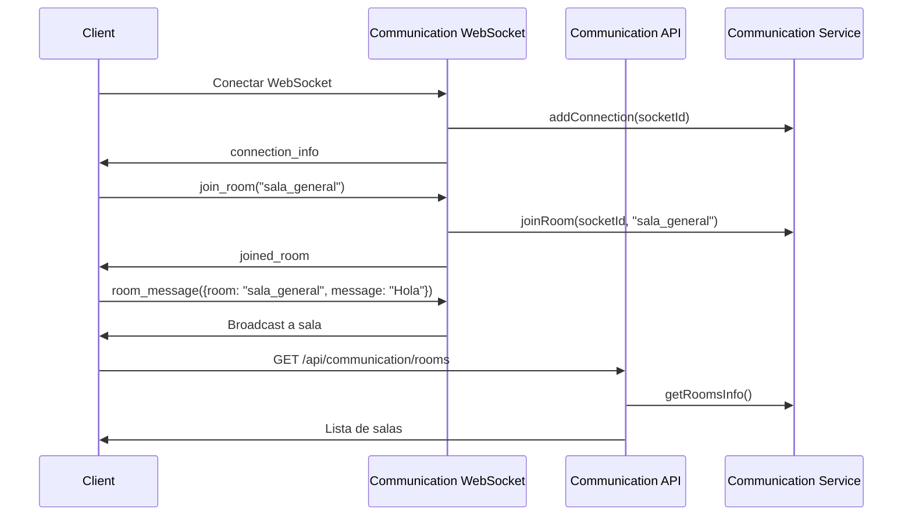
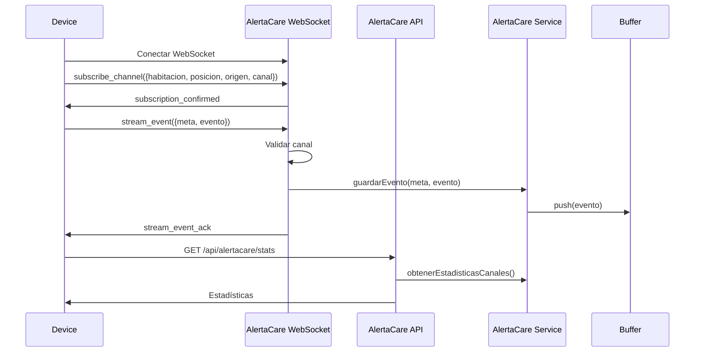
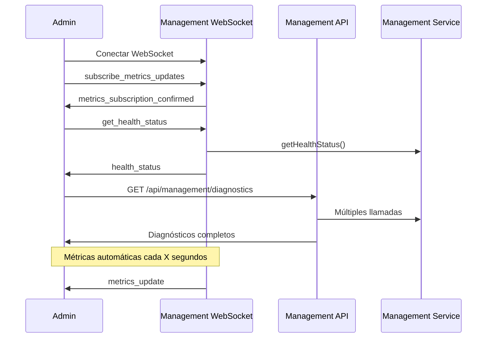

# Documento Funcional - care-relay-r2

## 📋 Información del Documento

**Versión**: 2.0 (Refactorizada por Contextos)
**Fecha**: Diciembre 2024
**Estado**: 100% Sincronizado con el Código Implementado ✅

## ⚠️ NOTA IMPORTANTE
Esta documentación funcional está completamente alineada con la implementación actual de care-relay-r2 refactorizada por contextos.

**Alcance Completo de esta Versión:**
- ✅ **Communication Context**: Relay de mensajes, salas, comunicación privada
- ✅ **Alerta Care Context**: Canales inference.tap y tracker.tap con buffers circulares
- ✅ **Management Context**: Métricas, logs, health checks, estadísticas
- ✅ **API REST Separada**: Endpoints organizados por contexto
- ✅ **WebSocket Events**: Eventos especializados por contexto
- ✅ **Logging Contextualizado**: Logs con identificación de contexto
- ✅ **Validaciones**: Validación específica por dominio

## 1. Introducción

### 1.1 Propósito del Sistema
**care-relay-r2** es un sistema de comunicación en tiempo real refactorizado con arquitectura por contextos de dominio. Facilita la comunicación general entre clientes, gestiona eventos especializados de telemetría médica y proporciona capacidades avanzadas de monitoreo y administración.

### 1.2 Objetivos del Sistema
- **Comunicación Multicontexto**: Soporte para diferentes tipos de comunicación según el dominio
- **Especialización por Contexto**: Funcionalidades específicas para cada área de responsabilidad
- **Observabilidad Completa**: Monitoreo detallado y métricas en tiempo real
- **Escalabilidad por Dominio**: Crecimiento independiente de cada contexto

### 1.3 Características Clave por Contexto

#### 💬 Communication Context
- Mensajería en tiempo real sin estado
- Gestión de salas temporales (en memoria)
- Comunicación privada punto a punto
- Gestión de metadatos de usuario

#### 🚨 Alerta Care Context
- Canales especializados: `inference.tap` y `tracker.tap`
- Buffers circulares por canal (1080 eventos por defecto)
- Validación estricta de canales
- Suscripción en tiempo real a canales

#### ⚙️ Management Context
- Métricas detalladas del sistema
- Logs estructurados con múltiples niveles
- Health checks con umbrales configurables
- Estadísticas históricas y en tiempo real

## 2. Casos de Uso por Contexto

### 2.1 Diagrama de Casos de Uso General

```mermaid
graph TB
    subgraph "Actores"
        UC[Cliente Comunicación]
        AC[Cliente AlertaCare]
        MC[Cliente Management]
        SYS[Sistema Monitoreo]
    end
    
    subgraph "Communication Context"
        UC1[Conectarse al Sistema]
        UC2[Enviar Mensaje General]
        UC3[Enviar Mensaje Privado]
        UC4[Gestionar Salas]
        UC5[Actualizar Metadatos]
    end
    
    subgraph "AlertaCare Context"
        AC1[Enviar Evento Stream]
        AC2[Suscribirse a Canal]
        AC3[Consultar Eventos]
        AC4[Validar Canal]
    end
    
    subgraph "Management Context"
        MC1[Consultar Métricas]
        MC2[Revisar Logs]
        MC3[Health Check]
        MC4[Reset Estadísticas]
        MC5[Diagnósticos]
    end
    
    UC --> UC1
    UC --> UC2
    UC --> UC3
    UC --> UC4
    UC --> UC5
    
    AC --> AC1
    AC --> AC2
    AC --> AC3
    AC --> AC4
    
    MC --> MC1
    MC --> MC2
    MC --> MC3
    MC --> MC4
    MC --> MC5
    
    SYS --> MC1
    SYS --> MC3
    SYS --> MC5
```



## 3. Funcionalidades Detalladas por Contexto

## 3.1 Communication Context (💬)

### 3.1.1 Gestión de Conexiones

**WebSocket Events:**
- `connection_info` - Información de conexión del cliente
- `user_connected` - Notificación de nueva conexión
- `user_disconnected` - Notificación de desconexión

**Flujo de Conexión:**
1. Cliente establece conexión WebSocket
2. Sistema asigna ID único y registra en CommunicationService
3. ManagementService actualiza contadores
4. Cliente recibe `connection_info` con su ID
5. Otros clientes reciben `user_connected`

**Ejemplo de connection_info:**
```javascript
{
  "id": "socket_abc123",
  "totalConnections": 5,
  "timestamp": "2024-01-01T12:00:00.000Z"
}
```

### 3.1.2 Mensajería General

**WebSocket Events:**
- `relay_message` (Cliente → Servidor) - Envío de mensaje general
- `relayed_message` (Servidor → Clientes) - Retransmisión a todos

**Flujo Principal:**
1. Cliente envía `relay_message` con datos
2. Servidor valida y retransmite a todos excepto emisor
3. Clientes reciben `relayed_message` con metadata

**Ejemplo:**
```javascript
// Cliente envía:
socket.emit('relay_message', {
  text: "Hola a todos",
  type: "announcement"
});

// Otros clientes reciben:
{
  "from": "socket_abc123",
  "data": {
    "text": "Hola a todos",
    "type": "announcement"
  },
  "timestamp": "2024-01-01T12:00:00.000Z"
}
```

### 3.1.3 Mensajería Privada

**WebSocket Events:**
- `private_message` (Cliente → Servidor) - Mensaje privado
- `message_delivered` (Servidor → Emisor) - Confirmación de entrega
- `message_error` (Servidor → Emisor) - Error en entrega

**Flujo Principal:**
1. Cliente envía `private_message` con targetId y mensaje
2. Sistema valida existencia del destinatario
3. Si existe: entrega mensaje y confirma con `message_delivered`
4. Si no existe: responde con `message_error`

**Ejemplo:**
```javascript
// Cliente envía:
socket.emit('private_message', {
  targetId: "socket_def456",
  message: "Mensaje privado confidencial"
});

// Destinatario recibe:
{
  "from": "socket_abc123",
  "message": "Mensaje privado confidencial",
  "timestamp": "2024-01-01T12:00:00.000Z"
}

// Emisor recibe confirmación:
{
  "targetId": "socket_def456",
  "timestamp": "2024-01-01T12:00:00.001Z"
}
```

### 3.1.4 Gestión de Salas

**WebSocket Events:**
- `join_room` - Unirse a sala
- `leave_room` - Abandonar sala
- `room_message` - Mensaje a sala
- `user_joined_room` - Notificación de usuario que se une
- `user_left_room` - Notificación de usuario que abandona

**Flujo de Unirse a Sala:**
1. Cliente envía `join_room` con nombre de sala
2. Sistema crea sala si no existe
3. Agrega cliente a la sala
4. Cliente recibe confirmación `joined_room`
5. Otros miembros reciben `user_joined_room`

**API REST Endpoints:**
- `GET /api/communication/rooms` - Lista todas las salas
- `GET /api/communication/rooms/:roomName` - Info de sala específica

### 3.1.5 API REST Communication

| Endpoint | Método | Descripción | Respuesta |
|----------|--------|-------------|-----------|
| `/api/communication/connections` | GET | Conexiones activas | Lista de ConnectionInfo |
| `/api/communication/rooms` | GET | Información de salas | Lista de RoomInfo |
| `/api/communication/rooms/:roomName` | GET | Sala específica | RoomInfo detallada |
| `/api/communication/users/:userId` | GET | Usuario específico | ConnectionInfo |
| `/api/communication/stats` | GET | Estadísticas | Stats de comunicación |

## 3.2 Alerta Care Context (🚨)

### 3.2.1 Canales Especializados

**Canales Soportados:**
- `inference.tap` - Eventos de inferencia médica
- `tracker.tap` - Eventos de tracking de pacientes

**Estructura del Canal:**
```
<habitacion>.<posicion>.<origen>.<canal>.tap
```

**Ejemplo de Channel Key:**
```
sala_102.cama_1.sensor_vital.inference.tap
```

### 3.2.2 Eventos de Stream

**WebSocket Events:**
- `stream_event` (Cliente → Servidor) - Envío de evento
- `stream_event_ack` (Servidor → Cliente) - Confirmación
- `stream_event_error` (Servidor → Cliente) - Error de validación
- `stream_event_broadcast` (Servidor → Clientes) - Broadcast del evento

**Flujo Principal:**
1. Cliente envía `stream_event` con meta y evento
2. Sistema valida canal (debe ser inference.tap o tracker.tap)
3. Guarda en buffer circular correspondiente
4. Responde con `stream_event_ack`
5. Hace broadcast a clientes suscritos

**Ejemplo de stream_event:**
```javascript
// Cliente envía:
socket.emit('stream_event', {
  meta: {
    habitacion: "sala_102",
    posicion: "cama_1",
    origen: "sensor_vital",
    canal: "inference.tap"
  },
  evento: {
    tipo: "alerta_critica",
    valor: 85,
    unidad: "bpm",
    timestamp_sensor: "2024-01-01T12:00:00.000Z"
  }
});

// Sistema responde:
{
  "channel": "sala_102.cama_1.sensor_vital.inference.tap",
  "timestamp": "2024-01-01T12:00:00.001Z"
}
```

### 3.2.3 Suscripción a Canales

**WebSocket Events:**
- `subscribe_channel` - Suscribirse a canal específico
- `unsubscribe_channel` - Desuscribirse de canal
- `subscription_confirmed` - Confirmación de suscripción
- `subscription_error` - Error en suscripción

**Flujo de Suscripción:**
1. Cliente solicita suscripción con parámetros del canal
2. Sistema valida parámetros
3. Agrega cliente a la sala del canal
4. Confirma suscripción
5. Cliente recibe eventos futuros del canal

### 3.2.4 Buffers Circulares

**Características:**
- **Tamaño por defecto**: 1080 eventos por canal
- **Persistencia**: En memoria (volátil)
- **Estructura**: Eventos con timestamp automático
- **Acceso**: Via API REST y WebSocket

**Ejemplo de evento buffereado:**
```javascript
{
  "habitacion": "sala_102",
  "posicion": "cama_1", 
  "origen": "sensor_vital",
  "canal": "inference.tap",
  "tipo": "alerta_critica",
  "valor": 85,
  "unidad": "bpm",
  "timestamp_sensor": "2024-01-01T12:00:00.000Z",
  "timestamp": "2024-01-01T12:00:00.001Z"  // Agregado automáticamente
}
```

### 3.2.5 API REST AlertaCare

| Endpoint | Método | Descripción | Parámetros |
|----------|--------|-------------|------------|
| `/streams/:habitacion/:posicion/:origen/:canal/events` | GET | Eventos de canal | Parámetros de ruta |
| `/alertacare/stats` | GET | Estadísticas | - |
| `/alertacare/channels` | GET | Lista de canales activos | - |
| `/channels/:channelKey/events` | GET | Eventos por channel key | channelKey |
| `/streams/:habitacion/:posicion/:origen/:canal/events` | POST | Crear evento (testing) | Body: evento |

**Ejemplo de respuesta de eventos:**
```javascript
{
  "eventos": [
    {
      "habitacion": "sala_102",
      "posicion": "cama_1",
      "origen": "sensor_vital", 
      "canal": "inference.tap",
      "tipo": "alerta_critica",
      "valor": 85,
      "timestamp": "2024-01-01T12:00:00.001Z"
    }
  ],
  "count": 1,
  "channel": "sala_102.cama_1.sensor_vital.inference.tap",
  "meta": {
    "habitacion": "sala_102",
    "posicion": "cama_1", 
    "origen": "sensor_vital",
    "canal": "inference.tap"
  },
  "timestamp": "2024-01-01T12:05:00.000Z"
}
```

## 3.3 Management Context (⚙️)

### 3.3.1 Métricas del Sistema

**WebSocket Events:**
- `get_server_stats` - Solicitar estadísticas
- `server_stats` - Respuesta con estadísticas
- `get_metrics` - Solicitar métricas detalladas
- `metrics` - Respuesta con métricas
- `subscribe_metrics_updates` - Suscribirse a actualizaciones
- `metrics_update` - Actualización automática de métricas

**Métricas Disponibles:**
- **Conexiones**: Actuales, total histórico, pico máximo
- **Salas**: Activas, distribución por tamaño
- **AlertaCare**: Canales activos, eventos totales
- **Performance**: CPU, memoria, uptime

**Ejemplo de métricas:**
```javascript
{
  "metrics": {
    "connections": {
      "current": 25,
      "total": 1547,
      "peak": 89
    },
    "rooms": {
      "current": 8,
      "total": 8
    },
    "alertacare": {
      "channels": 12,
      "totalEvents": 45678
    },
    "performance": {
      "uptime": 86400,
      "memoryUsage": {
        "heapUsed": 125829120,
        "heapTotal": 188743680,
        "external": 1854872
      }
    }
  },
  "timestamp": "2024-01-01T12:00:00.000Z"
}
```

### 3.3.2 Sistema de Logs

**WebSocket Events:**
- `get_logs` - Solicitar logs con filtros
- `logs` - Respuesta con logs
- `clear_logs` - Limpiar logs
- `logs_cleared` - Confirmación de limpieza

**Niveles de Log:**
- `debug` - Información de depuración detallada
- `info` - Información general del sistema
- `warn` - Advertencias que requieren atención
- `error` - Errores que requieren acción inmediata

**Contextos de Log:**
- `[COMMUNICATION]` - Eventos del contexto de comunicación
- `[ALERTA_CARE]` - Eventos del contexto de alerta care
- `[MANAGEMENT]` - Eventos del contexto de management

**Ejemplo de log:**
```javascript
{
  "level": "info",
  "message": "Private message delivered from socket_abc123 to socket_def456",
  "timestamp": "2024-01-01T12:00:00.000Z",
  "context": "COMMUNICATION"
}
```

### 3.3.3 Health Checks

**WebSocket Events:**
- `get_health_status` - Solicitar estado de salud
- `health_status` - Respuesta con estado

**Criterios de Salud:**
- **OK**: Sistema operando normalmente
- **WARNING**: Uso de memoria > 500MB
- **ERROR**: Uso de memoria > 1GB o errores críticos

**Ejemplo de health status:**
```javascript
{
  "status": "ok",
  "timestamp": "2024-01-01T12:00:00.000Z",
  "version": "2.0.0",
  "uptime": 86400,
  "memoryUsage": {
    "heapUsed": 125829120,
    "heapTotal": 188743680,
    "rss": 201326592,
    "external": 1854872
  },
  "cpuUsage": {
    "user": 12500000,
    "system": 2500000
  }
}
```

### 3.3.4 API REST Management

| Endpoint | Método | Descripción | Parámetros |
|----------|--------|-------------|------------|
| `/management/stats` | GET | Estadísticas del servidor | - |
| `/management/health` | GET | Estado de salud | - |
| `/management/system` | GET | Información del sistema | - |
| `/management/metrics` | GET | Métricas detalladas | - |
| `/management/logs` | GET | Logs del sistema | limit, level |
| `/management/logs` | DELETE | Limpiar logs | - |
| `/management/stats/reset` | POST | Reset estadísticas | - |
| `/management/diagnostics` | GET | Diagnósticos completos | - |

### 3.3.5 Diagnósticos Completos

El endpoint `/management/diagnostics` proporciona un resumen completo del sistema:

```javascript
{
  "diagnostics": {
    "overview": {
      "status": "ok",
      "uptime": 86400,
      "version": "2.0.0",
      "timestamp": "2024-01-01T12:00:00.000Z"
    },
    "health": { /* Health status completo */ },
    "stats": { /* Server stats completo */ },
    "system": { /* System info completo */ },
    "metrics": { /* Métricas completas */ },
    "recentLogs": {
      "logs": [ /* Últimos 50 logs */ ],
      "count": 50
    }
  },
  "generatedAt": "2024-01-01T12:00:00.000Z"
}
```

## 4. Flujos de Trabajo Completos

### 4.1 Flujo de Cliente de Comunicación



### 4.2 Flujo de Cliente AlertaCare



### 4.3 Flujo de Cliente Management



## 5. Validaciones y Errores por Contexto

### 5.1 Communication Context

**Validaciones:**
- Existencia de usuario destino en mensajes privados
- Nombres de sala válidos
- Metadatos en formato JSON válido

**Errores Comunes:**
- `Usuario no encontrado` - targetId inválido en mensaje privado
- `Sala no encontrada` - Acceso a sala inexistente
- `Formato de metadata inválido` - JSON malformado

### 5.2 AlertaCare Context

**Validaciones:**
- Canal debe ser `inference.tap` o `tracker.tap`
- Metadatos completos (habitacion, posicion, origen, canal)
- Formato de evento válido

**Errores Comunes:**
- `Canal inválido: debe ser inference.tap o tracker.tap`
- `Parámetros requeridos: habitacion, posicion, origen, canal`
- `Payload inválido: meta y evento son requeridos`

### 5.3 Management Context

**Validaciones:**
- Límites de logs (1-10000)
- Niveles de log válidos
- Permisos de administración (futuro)

**Errores Comunes:**
- `Límite debe estar entre 1 y 10000`
- `Nivel de log inválido`
- `Error al obtener métricas`

## 6. Consideraciones de Performance

### 6.1 Buffers Circulares
- **Memoria**: Límite de 1080 eventos por canal
- **Acceso**: O(1) para inserción, O(n) para lectura completa
- **Limpieza**: Automática por sobrescritura

### 6.2 Gestión de Conexiones
- **Tracking**: En memoria con Map/Set
- **Limpieza**: Automática en desconexión
- **Escalabilidad**: Testear con 1000+ conexiones

### 6.3 Logging
- **Límite**: Máximo 1000 logs en memoria
- **Rotación**: Automática por FIFO
- **Performance**: Asíncrono sin bloqueo

## 7. Casos de Uso Avanzados

### 7.1 Monitoreo en Tiempo Real

**Scenario**: Dashboard de administración que monitorea el sistema
1. Admin se conecta via WebSocket
2. Se suscribe a `metrics_updates`
3. Recibe métricas cada 30 segundos automáticamente
4. Consulta logs cuando detecta anomalías
5. Puede resetear estadísticas si es necesario

### 7.2 Sistema de Alerta Médica

**Scenario**: Dispositivo médico enviando telemetría
1. Dispositivo se conecta y valida canal `inference.tap`
2. Se suscribe a su canal específico
3. Envía eventos continuos de sensores
4. Otros dispositivos suscritos reciben alertas en tiempo real
5. Personal médico consulta histórico via API REST

### 7.3 Chat de Sala con Moderación

**Scenario**: Sala de chat con funcionalidades avanzadas
1. Usuarios se conectan y unen a sala
2. Moderador recibe notificaciones de nuevos usuarios
3. Usuarios intercambian mensajes en sala
4. Moderador puede ver estadísticas via API
5. Sistema mantiene log de todas las actividades

## 8. Integración y Testing

### 8.1 Testing por Contexto
- **Unit Tests**: Servicios aislados con mocks
- **Integration Tests**: Controladores con servicios reales
- **E2E Tests**: Flujos completos por contexto

### 8.2 Mocking
- **CommunicationService**: Mock para testing de API
- **AlertaCareService**: Mock con buffers simulados
- **ManagementService**: Mock con métricas predefinidas

### 8.3 Testing Examples

```javascript
// Test de Communication Context
describe('CommunicationService', () => {
  it('should add connection successfully', () => {
    const service = new CommunicationService();
    service.addConnection('test-socket-id');
    expect(service.getConnectionsCount()).toBe(1);
  });
});

// Test de AlertaCare Context
describe('AlertaCareService', () => {
  it('should store event in correct channel', () => {
    const service = new AlertaCareService();
    const meta = { habitacion: 'sala1', posicion: 'cama1', origen: 'sensor', canal: 'inference.tap' };
    service.guardarEvento(meta, { valor: 100 });
    const eventos = service.obtenerEventos(meta);
    expect(eventos).toHaveLength(1);
  });
});
```

## 9. Conclusiones

La refactorización por contextos de care-relay-r2 proporciona:

### 9.1 Ventajas Funcionales
- **Especialización**: Cada contexto optimizado para su dominio
- **Escalabilidad**: Crecimiento independiente por área
- **Mantenibilidad**: Código organizado y predecible
- **Observabilidad**: Logging y métricas contextualizadas

### 9.2 Casos de Uso Cubiertos
- ✅ Comunicación general entre clientes
- ✅ Telemetría médica especializada
- ✅ Monitoreo y administración completa
- ✅ APIs REST organizadas
- ✅ WebSocket events especializados

### 9.3 Preparación para el Futuro
- Fácil adición de nuevos contextos
- Patrón arquitectónico establecido
- Base sólida para autenticación y autorización
- Estructura preparada para persistencia 